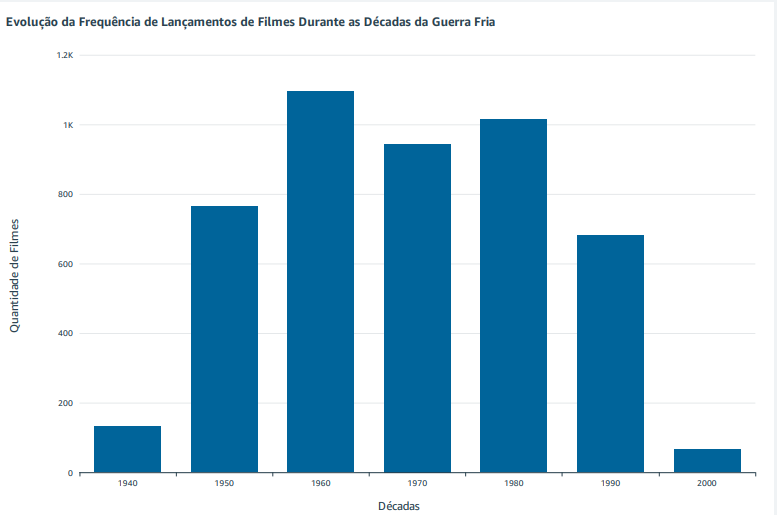
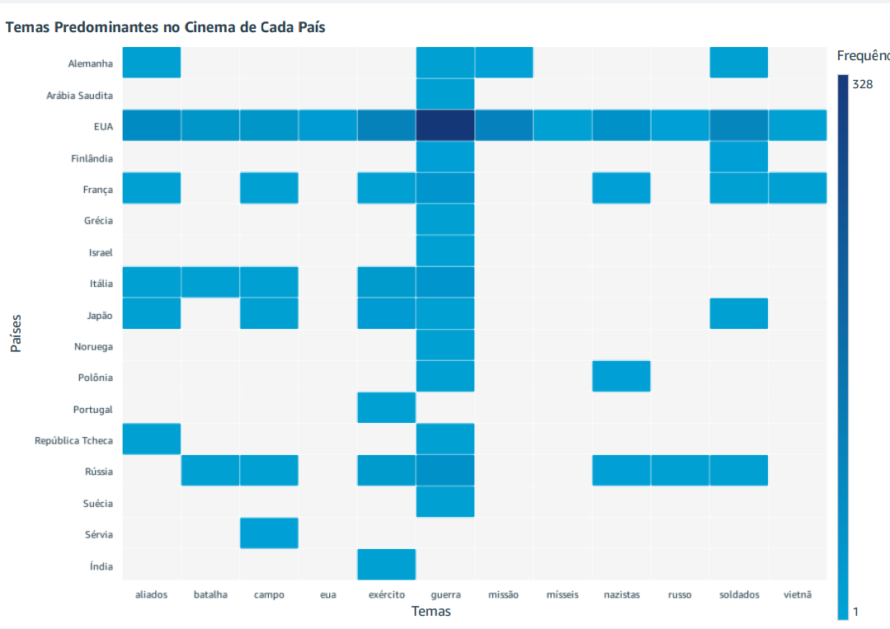
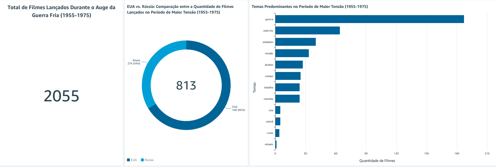
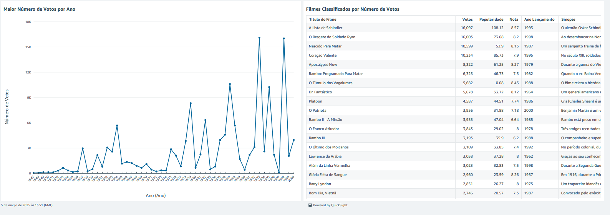

### 📝 Explicação sobre o desafio

- Este desafio consiste na criação de um dashboard sobre o tema **"Análise dos filmes de guerra durante a Guerra Fria"**, utilizando dados previamente ingeridos, processados e tratados no datalake. O objetivo é responder às perguntas propostas e desenvolver uma narrativa envolvente (storytelling) com base nos dados, explorando insights e contando a história por trás dos filmes desse período.

### Perguntas a serem respondidas:

1. Como a frequência de lançamentos de filmes de crime/guerra variou ao longo das décadas da Guerra Fria (1947-1991)?
 
2. Quais são os temas ou enredos mais comuns nos filmes de crime/guerra durante os momentos de maior tensão da Guerra Fria, como a Crise dos Mísseis de Cuba (1962) ou a Guerra do Vietnã (1955-1975)?
 
3. Como o país de produção dos filmes influenciou a representação de nacionalidades e conflitos nas narrativas cinematográficas?
 
4. Existe uma tendência nas produções de filmes de crime/guerra ao longo da Guerra Fria que reflete mudanças nas percepções públicas de ameaças internacionais?
 
5. Como a popularidade média e a avaliação do público dos filmes de crime/guerra variaram ao longo do período da Guerra Fria, e há correlação com eventos históricos específicos?"

### 1º Gráfico: Evolução da Frequência de Lançamentos de Filmes Durante as Décadas da Guerra Fria



- Para construir o gráfico acima, criei um campo calculado chamado "Décadas" para o eixo X, utilizando o seguinte código no campo calculado:

    - ````````
        floor(extract('YYYY', {data_lancamento}) / 10) * 10
        ````````
- Para o eixo Y, utilizei a contagem de todos os títulos de filmes distintos. Dessa forma, foi possível representar corretamente no gráfico a quantidade de filmes lançados por década e responder adequadamente a 1º pergunta.

### 2º Gráfico: Temas Predominantes no Cinema de Cada País



- Para filtrar adequadamente os temas mais comuns de acordo com o país de lançamento dos filmes, e assim conseguir criar o gráfico, foi necessário criar uma tabela view. Esse processo foi realizado utilizando o Amazon Athena com a seguinte query:

    - [Query para a tabela frequencia_palavras_filmes](../Desafio/frequencia_palavras_filmes.sql)
        - Essa query é dividia em basicamente 3 etapas, na primeira etapa ela filtra filmes dos gêneros "Crime" ou "Guerra", na segunda etapa ela extrai palavras específicas relacionadas aos temas da guerra fria das sinopses desses filmes e na terceira ela conta quantas vezes cada palavra aparece, agrupando por palavra e país de produção.
        - Após essas 3 etapas, são criadas 3 colunas para a tabela view: uma com as palavras extraidas, outra com o país de produção de filmes e a última com a frêquencia que as palavras aparecem.
###

- Após criar a tabela view, precisei adicionar um campo calculado para substituir as siglas dos países pelos seus respectivos nomes completos.

- Com tudo isso concluído, foi possível criar efetivamente um gráfico de calor, que exibe as palavras (ou temas) mais comuns por país, respondendo, assim, à terceira pergunta.

### 3º, 4º e 5º Gráfico: Sobre os Filmes Lançados no Período de Maior Tensão da Guerra Fria (1955 - 1975)

  

 - Esses três gráficos se complementam. O primeiro mostra o total de filmes lançados durante o auge da Guerra Fria, representando cerca de 42% dos aproximadamente 4.900 filmes analisados. O gráfico de rosca, por sua vez, detalha quantos desses filmes foram produzidos pelos EUA ou pela Rússia, indicando que cerca de 40% deles foram lançados por esses dois países. Já o gráfico de barras horizontais revela os temas mais abordados durante o mesmo período. Juntos, esses gráficos se completam e respondem de forma clara à segunda pergunta.

###

 - Para a criação do gráfico de barras foi necessário criar outra tabela view. Esse processo foi realizado utilizando o Amazon Athena com a seguinte query:
    - [Query para a tabela enredos_mais_comuns_filmes](../Desafio/enredos_mais_comuns_filmes.sql)
         - Essa query é dividida em 2 etapas, na primeira etapa ela filtra filmes dos gêneros "Crime" ou "Guerra" que foram produzidos entre o ano de 1955 e 1975 ou especificamente no ano de 1962. Na segunda etapa, ela extrai as palavras específicas relacionadas aos tema de guerra fria das sinopses desses filmes.
         - Após essas 2 etapas, são criadas 4 colunas para a tabela view: Uma com as palavras extraidas, outra com os títulos dos filmes, outra com as datas de lançamento dos filmes e a última com o nome dos gêneros dos filmes. 

### 6º e 7º Gráficos: Popularidade dos filmes ao longo dos anos e verificar tendências.



- Os dois visuais se complementam. O gráfico de linhas exibe a popularidade dos filmes ao longo dos anos da Guerra Fria e é interativo: ao clicar em um ano específico, a tabela se atualiza, mostrando todos os filmes lançados naquele período, classificados por popularidade. Além de revelar a popularidade, o gráfico também permite identificar possíveis tendências. Por exemplo, é possível observar se houve um aumento no lançamento de filmes sobre a Guerra do Vietnã durante o conflito, sugerindo uma tentativa de influenciar a percepção pública sobre o tema. Repondendo assim, a 4º e a 5º pergunta.

- Para construir o gráfico de linhas, utilizei a coluna total_votos no eixo Y e a coluna data_lancamento no eixo X, considerando apenas o ano de lançamento. Já a tabela exibe o título do filme, o número de votos, a popularidade, a nota, o ano de lançamento e a sinopse de cada filme, fornecendo todas as informações necessárias para responder corretamente a 4º e 5º pergunta.