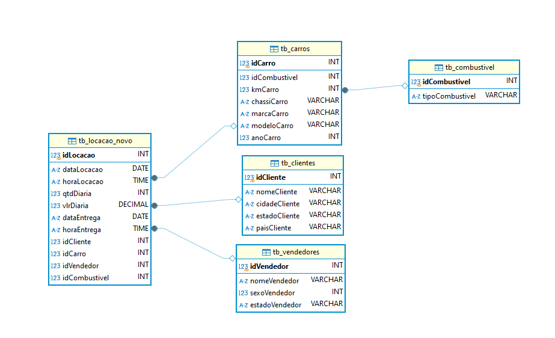
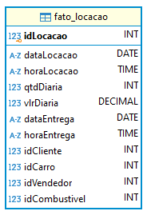
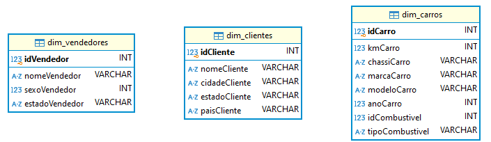
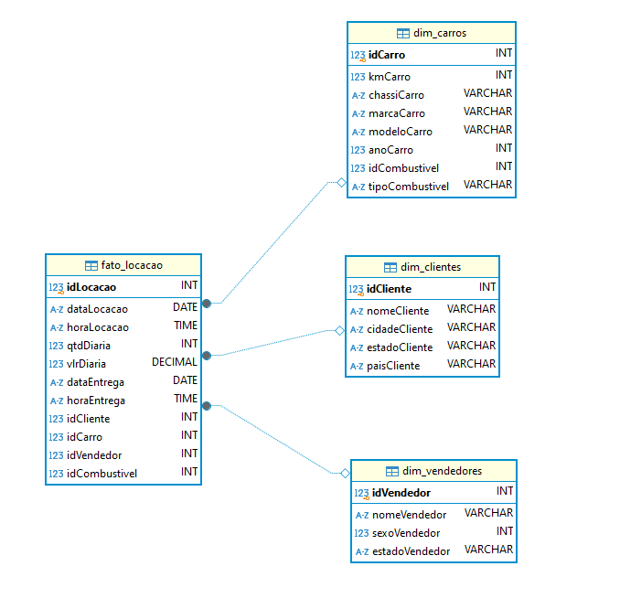

<h1 align="center">Resolução do Desafio ✍️</h1>


### 📝 Explicação sobre o desafio
    
O objetivo é transformar um banco de dados inicial, composto por uma única tabela que armazena informações sobre clientes, carros, tipos de combustível, vendedores e locações de uma concessionária, em um banco de dados eficiente e otimizado para análise de dados. Este processo envolve duas etapas principais: a normalização do banco de dados e sua posterior conversão para um modelo dimensional.

###

## Etapa 1️⃣: Normalização do Banco de Dados

- A normalização busca eliminar redundâncias e dependências inadequadas nos dados, organizando-os em tabelas relacionadas. Esta etapa será dividida nas três formas normais (1FN, 2FN e 3FN).

### Primeira forma normal (1FN)
- A primeira forma normal (1NF) é o primeiro nível de normalização e possui os seguintes critérios:
    - Cada célula na tabela deve conter apenas um valor (atomicidade).
    - A tabela deve ter uma chave primária para identificação única de cada registro.
    - Não pode haver duplicação de linhas ou colunas.
    - Cada coluna deve ter apenas um valor para cada registro na tabela.

- Na primeira forma normal, é uma boa prática identificar e corrigir inconsistências nos dados, garantindo que eles estejam consistentes para aplicar as outras formas normais.

###

#### 1º Passo: Atomicidade

- Verifiquei se havia atributos multivalorados, aqueles que podem armazenar múltiplos valores para uma única entidade, e atributos compostos, aqueles que podem ser divididos. A resposta foi não. Todos os dados da tabela original já estavam atômicos.
    - Por exemplo, na tabela original, a coluna nomeCliente armazena apenas um nome por registro, e a coluna marcaCarro contém apenas uma marca para cada carro. Isso mostra que os valores já estão de acordo com a atomicidade.

- Podemos ver na imagem a seguir que os atributos (colunas) da tabela original só permitem valores atômicos:

 

###

#### **2º Passo: Identificar inconsistência nos dados** 

- Verifiquei se havia dados inconsistentes e, ao fazer isso, notei que a coluna dataLocacao estava no formato DATETIME. Porém, armazenar o horário nessa coluna era desnecessário, tendo em vista que a coluna horaLocacao já tem essa função. Além disso, a formatação apresentava problemas visuais. Percebi, então, a necessidade de alterar o formato dos dados de DATETIME para DATE. A coluna dataEntrega também apresentava problemas semelhantes na visualização, por isso optei por ajustar a exibição de ambas as colunas para o formato "YYYY-MM-DD". Somente essas duas colunas apresentavam inconsistências. 
###
- Podemos ver na imagem a seguir como as datas estavam visualmente erradas:


- obs: A mudança no formato das colunas ocorrerá no próximo passo.

###

#### **3º Passo: Chave Primária e resolver inconsistências**
- Para que a tabela `tb_locacao` tivesse uma chave primária, reorganizei toda a estrutura do banco de dados. Agrupei cada conjunto de dados em tabelas individuais, considerando também as chaves primárias das novas tabelas. Por exemplo, todos os dados relacionados a carros foram colocados em uma tabela, o mesmo ocorreu com os dados de vendedores, etc.

- As tabelas ficaram organizadas da seguinte forma:
    - ``tb_clientes``, 
        - a qual armazena todos os dados relacionados aos clientes e se relaciona com a tabela tb_locacao
    - ``tb_carros``
        - a qual armazena todos os dados relacionados aos carros e se relaciona com a tabela tb_locacao
    - ``tb_combustivel``
        - a qual armazena todos os dados relacionados aos combustiveis e se relaciona com a tabela tb_carros
    - ``tb_vendedores``
        - a qual armazena todos os dados relacionados aos vendedores e se relaciona com a tabela tb_locacao
    - ``tb_locacoes``
        - a qual armazena todos os dados referente as locações feitas, se relaciona com as tabelas clientes, carros e vendedores.

- O código da criação das tabelas é o seguinte: [Criação das Tabelas](../Desafio/etapa-1/criacaoTabelas.sql)

- O diagrama do banco de dados reorganizado ficou assim:


- Como é possível notar no diagrama acima, as colunas dataLocacao e dataEntrega tiveram o formato dos dados alterados de DATETIME para DATE. 
    - obs: O problema da exibição dos dados será resolvido mais a frente.

#### 4º Passo: Finalização da 1FN
- Com todos os passos acima, todas as tabelas estão na 1º forma normal, pois seguem os seguintes critérios: 
    - Cada célula de cada tabela contem apenas um valor (atomicidade).
    - Todas as tabelas tem uma chave primária.
    - Não há duplicação de linhas ou colunas.
    - Cada coluna tem apenas um valor para cada registro na tabela.

###

### Segunda Forma Normal (2FN)
- A segunda forma normal (2FN) é alcançada quando uma tabela já está na primeira forma normal (1FN) e não há dependências de qualquer atributo não-chave em apenas parte da chave primária. 

- Como todas as tabelas possuem chave primária simples, não há possibilidade de os atributos dependerem apenas de parte da chave. Isso só aconteceria se a tabela tivesse uma chave primária composta, o que não é o caso.
    - Consequentemente, todas as tabelas já estão na segunda fase normal.

###

### Terceira Forma Normal (3FN)
- A terceira forma normal é atingida quando uma tabela está na segunda forma normal e não há dependências funcionais transitivas. Ou seja, além de depender da chave primária, os atributos não-chave não podem depender de outros atributos não-chave.

- Diagrama do banco de dados:


- Ao observar minuciosamente as tabelas do diagrama acima, percebemos que nenhum atributo tem dependência funcional transitiva, todos dependem unicamente das chaves primárias de suas respectivas tabelas
    - Consequentemente, todas as tabelas também já estão na terceira forma normal.

###

### População das Tabelas

- Código da transferência de dados da tb_locacao para as demais tabelas: [Código](../Desafio/etapa-1/TransferenciaDados.sql)

- #### Detalhes na exportação 
    - Todos os dados foram extraídos da tabela `tb_locacao`

    - Como a `tb_locacao` possuia dados repetidos, por exemplo: Um mesmo carro alugado várias vezes, um mesmo cliente que alugou vários carros, etc. Foi necessário utilizar o `SELECT DISTINCT` para que somente dados únicos fossem exportados para a tabela destino.
    - A seguinte parte do código:
     ````
    UPDATE tb_carros 
    SET kmCarro = (
	    SELECT MAX(kmCarro)
	    FROM tb_locacao 
	    WHERE tb_locacao.idCarro = tb_carros.idCarro 
    ) 
    WHERE kmCarro is not NULL; 
    `````
    - Trata especificamente da atualização dos dados referentes à quilometragem dos carros. Foi necessário realizar um `UPDATE` específico porque um mesmo carro possuía várias entradas de quilometragem. Para resolver essa questão, optei por exportar para a `tb_carros` apenas a maior quilometragem disponível para cada carro. Isso foi alcançado através de uma subquery no comando SET, que seleciona a quilometragem máxima associada a cada carro na tabela `tb_locacao`.

    - O final do código:
    `````
    --Setando a dataLocacao no formato "YYYY-mm-dd"
    UPDATE tb_locacao_novo 
    SET dataLocacao = SUBSTRING(dataLocacao, 1, 4)  || '-' || SUBSTRING(dataLocacao, 5, 2) || '-' || SUBSTRING(dataLocacao, 7, 2); 
 
    --Setando a dataEntrega no formato "YYYY-mm-dd"
    UPDATE tb_locacao_novo 
    SET dataEntrega = SUBSTRING(dataEntrega , 1, 4)  || '-' || SUBSTRING(dataEntrega , 5, 2) || '-' || SUBSTRING(dataEntrega , 7, 2); 
    `````
    - Trata a exibição das colunas `dataLocacao` e `dataEntrega` para o formato "YYYY-MM-DD"
    
###

## Etapa 2️⃣: Conversão para o Modelo Dimensional.

- A modelagem dimensional visa facilitar a análise de dados ao organizá-los de maneira eficiente. Ela faz isso através de uma tabela fato, que armazena as métricas de negócios e chaves estrangeiras, e tabelas de dimensão, que fornecem contexto com seus atributos descritivos. Para tornar a conexão entre a tabelas clara e direta, adotei o esquema estrela, que liga a tabela fato às suas dimensões de forma simples e intuitiva.

### 1º Passo: Tabelas Fato
- A tabela fato captura os principais eventos de negócio. No caso, a tabela fato se derivou da tabela tb_locacao_novo, pois ela já armazenava todos os eventos das locações
    - fato_locacao: Esta tabela contem métricas quantitativas ou fatos numéricos, que são os eventos das locações, como qtdDiaria e vlrDiaria. Possui como chave primária o idLocacao e como chave estrangeira o idCliente, idCarro, idCombustivel e idVendedor

    - Imagem da tabela fato:

    - 

### 2º Passo: Identificação das Dimensões

- As dimensões são entidades que fornecem o contexto para a tabela fato. Elas descrevem os dados capturados na tabela fato. 

- Eu indentifiquei as dimensões a partir das tabelas existentes, e elas ficaram assim:
    - Dimensão Cliente: Derivada da tabela tb_clientes, contém informações como nomeCliente, cidadeCliente, estadoCliente, paisCliente. Possui como chave primária o idCliente

    - Dimensão Carro: Derivada da tabela tb_carros, contém atributos como marcaCarro, modeloCarro, anoCarro, chassiCarro. Possui como chave primária o idCarro
        - No modelo dimensional, optei por integrar a informação de combustível diretamente dentro da dimensão Carro. Isso porque, no contexto dimensional, o tipo de combustível é visto como uma característica inerente ao carro. Eliminando assim a necessidade de uma dimensão separada para combustível

    - Dimensão Vendedor: Derivada da tabela tb_vendedores, com atributos como nomeVendedor, sexoVendedor, estadoVendedor. Possui como chave primária o idVendedor

- Imagem das dimensões:
 

 - O código da criação da tabela fato e todas as dimensões acimas descritas se econtra [aqui](../Desafio/etapa-2/CriacaoDimensional.sql).

### 3º Passo: Construção do Esquema Estrela

- Após a criação das tabelas fato e dimensões, foi possível estabelecer o esquema estrela. Nesse esquema, a tabela fato é posicionada no centro e se conecta às tabelas de dimensão através de suas chaves primárias e estrangeiras correspondentes.

- Imagem do esquema estrela e respectivas ligações entre a tabela fato e suas dimensões:

