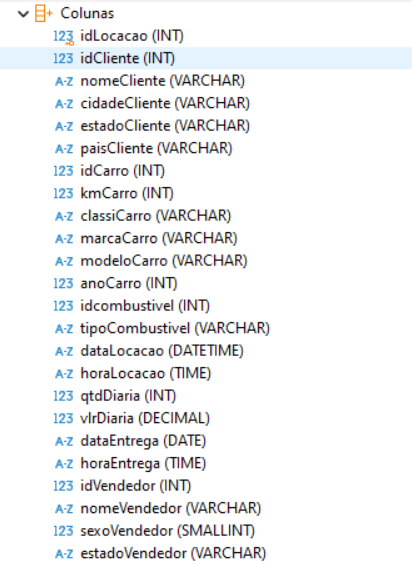
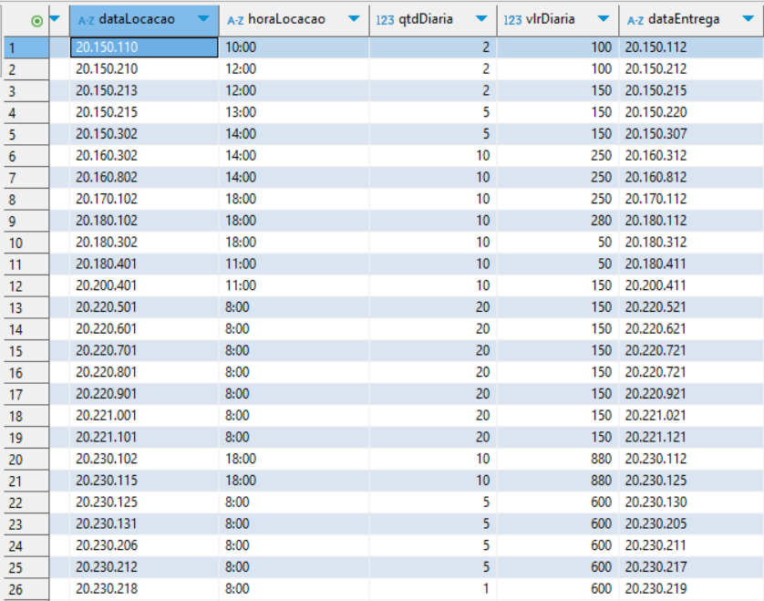

<h1 align="center">Resolução Desafio ✍️</h1>

### 📝 Explicação sobre o desafio
    
O objetivo é transformar um banco de dados inicial, composto por uma única tabela que armazena informações sobre clientes, carros, tipos de combustível, vendedores e locações de uma conssecionária, em um banco de dados eficiente e consistente. Este processo envolve duas fases principais: a normalização do banco de dados e sua posterior conversão para um modelo dimensional.

###

## Fase 1️⃣: Normalização do Banco de Dados

### Primeira fase normal (1FN)
- O objetivo da primeira fase normal é transformar todos os atributos da tabela em atributos atômicos, indivisíveis, e indentificar possíveis inconsistências nos dados afim de corrigi-los
###
#### 1º Passo:

- Verifiquei se haviam atributos multivalorados, aqueles que podem armazenas múltiplos valores para uma única entidade, e atributos compostos, aqueles que podem ser divididos, e a resposta foi não. Todos os dados da tabela original já estavam atômicos.

- Podemos ver na imagem a seguir que os atributos (colunas) da tabela original só permitem valores atômicos:

 
###
#### **2º Passo:** 

- Verifiquei se haviam dados inconsistentes, fazendo isso notei que a coluna dataLocacao estava no formato DATETIME e sua formatação apresentava problemas visuais. Decidi, então, alterar o formato dos dados de DATETIME para DATE. Além disso, a coluna dataEntrega também apresentava problemas semelhantes na visualização, por isso optei por ajustar a exibição de ambas as colunas para o formato "YYYY-MM-DD". Somente essas 2 colunas apresentavam inconsistências. 
###
- Podemos ver na imagem a seguir como as datas estavam vizualmente erradas:

- No SQLite, é impossível alterar o formato de dados de uma tabela existente, porém há uma maneira de contornar isso seguindo os seguintes passos:
    - Criar uma Nova Tabela
    - Copiar Dados para a Nova Tabela
    - Excluir a Tabela Antiga
    - Renomear a Nova Tabela

- Sabendo disso, ao invés de apenas recriar a tabela ``tb_locacao``, aproveitei para reorganizar toda a estrutura do banco de dados, criando as seguintes tabelas:
    - ``tb_clientes``, 
        - a qual armazena todos os dados relacionados aos clientes e se relaciona com a tabela tb_locacao
    - ``tb_carros``
        - a qual armazena todos os dados relacionados aos carros e se relaciona com a tabela tb_locacao
    - ``tb_combustivel``
        - a qual armazena todos os dados relacionados aos combustiveis e se relaciona com a tabela tb_carros
    - ``tb_vendedores``
        - a qual armazena todos os dados relacionados aos vendedores e se relaciona com a tabela tb_locacao
    - ``tb_locacoes``
        - a qual armazena todos os dados referente as locações feitas, se relaciona com as tabelas clientes, carros e vendedores.

- Query que criou todas as tabelas: