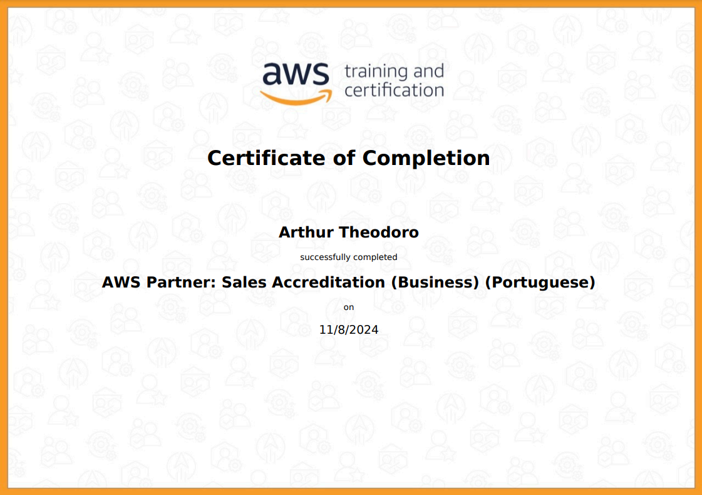

<h1 align="center">README Sprint 2</h1>

# Instruções

Este arquivo será o relato da sua entrega. Neste arquivo você fará a organização geral ao longo da Sprint. Esperamos que haja, minimamente:

- Uma ou mais seções para descrever o que estiver aprendendo (resumo), de maneira estruturada.

- Breve conteúdo de cada pasta relacionada a sprint.

# Resumo

### SQL
 - No curso de SQL, aprendi técnicas essenciais para manipulação e análise de dados. Comecei com a sintaxe básica do SQL e, em seguida, aprendi sobre o uso das cláusulas WHERE e GROUP BY. Aprendi a utilizar JOINs para relacionar tabelas e combinar dados de diferentes fontes de forma eficaz. Compreendi como criar consultas complexas usando Subqueries e ganhei habilidade em criar, excluir e alterar tabelas, colunas e linhas.

- Além disso, entendi o processo de normalização de bancos de dados, aprendendo a normalizar um banco de dados desde o início. Também explorei a diferença entre os modelos relacional e dimensional e adquiri a capacidade de transformar um modelo relacional em um dimensional.

### **AWS:** 
Tive meu primeiro contato com a plataforma "AWS Skill Builder" e aprofundei meu conhecimento sobre o ecossistema AWS. Aprendi sobre as vantagens de sua implementação, bem como sobre seu ecossistema de vendas, projetos e suporte.

###

# Exercícios

1. [Resposta Exercício 1.](./Exercicios/Exercicio1.sql)

2. [Resposta Exercício 2.](./Exercicios/Exercicio2.sql)

3. [Resposta Exercício 3.](./Exercicios/Exercicio3.sql)

4. [Resposta Exercício 4.](./Exercicios/Exercicio4.sql)

5. [Resposta Exercício 5.](./Exercicios/Exercicio5.sql)

6. [Resposta Exercício 6.](./Exercicios/Exercicio6.sql)

7. [Resposta Exercício 7.](./Exercicios/Exercicio7.sql)

8. [Resposta Exercício 8.](./Exercicios/Exercicio8.sql)

9. [Resposta Exercício 9.](./Exercicios/Exercicio9.sql)

10. [Resposta Exercício 10.](./Exercicios/Exercicio10.sql)

11. [Resposta Exercício 11.](./Exercicios/Exercicio11.sql)

12. [Resposta Exercício 12.](./Exercicios/Exercicio12.sql)

13. [Resposta Exercício 13.](./Exercicios/Exercicio13.sql)

14. [Resposta Exercício 14.](./Exercicios/Exercicio14.sql)

15. [Resposta Exercício 15.](./Exercicios/Exercicio15.sql)

16. [Resposta Exercício 16.](./Exercicios/Exercicio16.sql)

17. [Exportação de Dados Etapa01 .SQL](./Exercicios/Exportacao-de-Dados/Etapa01.sql)
- 17.1 [Exportação de Dados Etapa01 .CSV](./Exercicios/Exportacao-de-Dados/Etapa01.csv)

18 [Exportação de Dados Etapa02 .SQL](./Exercicios/Exportacao-de-Dados/Etapa02.csv)
- 18.1 [Exportação de Dados Etapa02 .CSV](./Exercicios/Exportacao-de-Dados/Etapa02.csv)

###

# Evidências

Todas as evidências estão diretamente correlacionadas com a resolução do desafio e foram utilizadas no [README do desafio](./Desafio/README.md) para ilustrar, através de imagens, os passos necessários que foram seguidos. Isso inclui cada etapa do processo, desde a identificação do problema até a implementação da solução.

###

# Certificados

Certificado do Curso AWS Partner: Sales Accreditation

