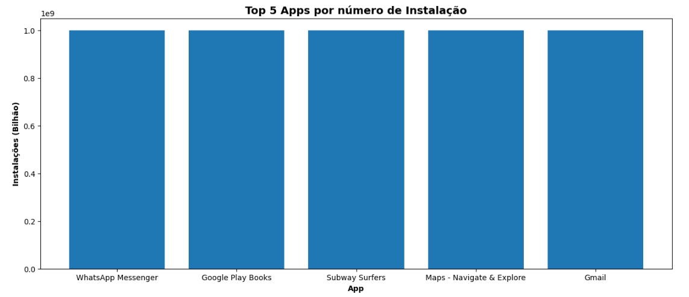
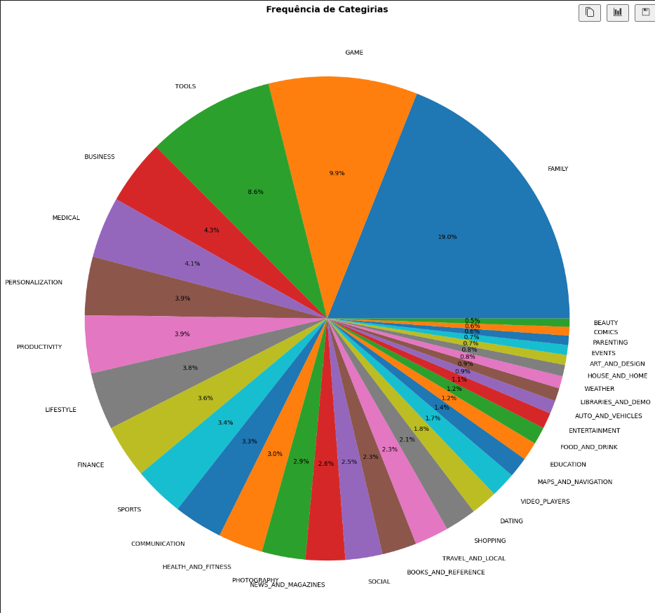
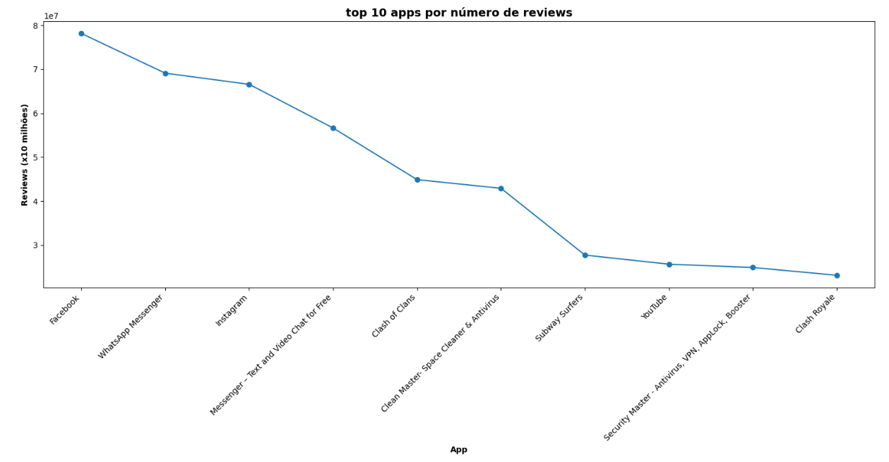

<h1 align="center">Resolução do Desafio ✍️</h1>

### 📝 Explicação sobre o desafio

O objetivo deste desafio é ler, manipular, tratar e apresentar dados de aplicativos da Google Play Store utilizando um DataFrame. Para isso, empregaremos as bibliotecas Pandas para o processamento dos dados e Matplotlib para visualizá-los por meio de gráficos, seguindo as regras de negócio estabelecidas.

### Primeiros passos

###
- O primeiro passo para a resolução desse desafio foi importar as bibliotecas que seriam utilizadas, nesse caso, a pandas e a matplotlib.

    - ```` 
        import pandas as pd
        import matplotlib.pyplot as plt
        ````
###

- Com as bibliotecas já importadas para o código, o processo de processamento de dados pode começar. A primeira etapa é acessar os dados abrindo o arquivo correspondente, o que foi feito utilizando a biblioteca Pandas.
    - ````
        dados = pd.read_csv("C:/Users/arthu/OneDrive/Desktop/Programa de Bolsas/PB-Compass/Sprint 3/Desafio/googleplaystore.csv")
        ````
        - Como o arquivo de dados está em formato .csv, utilizei o método ``.read_csv()``, fornecendo como argumento o caminho onde o arquivo está localizado.


### Removendo Duplicatas

- Para processar corretamente os dados, foi necessário remover as linhas duplicadas do DataFrame. A estratégia escolhida foi identificar uma informação que deveria ser exclusiva para cada linha, e o nome do App foi a escolha ideal, já que não existem dois aplicativos com o mesmo nome. Assim, usei a coluna "App" como base para a remoção de duplicatas, garantindo que sempre a linha mais recente, ou seja, a mais atualizada, fosse mantida.
    - ````
        dados_filtrados = dados.drop_duplicates(keep='first', subset=["App"])
        ````
- Houve uma redução de mais de 1000 linhas do DataSet

###

### Criação do gráfico dos top 5 apps por número de instalação

- Para a criação do gráfico dos top 5 apps por número de instalação, eu precisava primeiramente encontrar quais são esses Apps. 

- O primeiro obstáculo foi que, ao utilizar o método ``.sort_values()``, percebi que a ordenação não estava funcionando como esperado. Isso ocorreu porque a coluna "Installs" estava no formato de string, fazendo com que a ordenação priorizasse a ordem alfabética em vez da numérica.
    - Para resolver esse problema, tratei a coluna "Installs" removendo caracteres especiais com o método ``.replace()``. Em seguida, converti os valores para o tipo de dados "float" usando o método ``pd.to_numeric()``, que altera para o tipo desejado e lida com possíveis erros de conversão.
        - ````
            #garantindo que a coluna seja string
            dados_filtrados.loc[:, "Installs"] = dados_filtrados["Installs"].astype(str)
            
            #tratando caracteres especiais
            dados_filtrados.loc[:, "Installs"] = dados_filtrados["Installs"].str.replace(",", "").str.replace("+", "")

            #mudando para float e tratando os erros
            dados_filtrados.loc[:, "Installs"] = pd.to_numeric(dados_filtrados["Installs"], errors='coerce', downcast='float').fillna(0)
            ````
###
- Após tratar os dados de forma satisfatóra, utilizei a biblioteca pandas para filtrar os dados que seriam consumidos pelo gráfico e a matplotlib para cria-lo

    - Imagem do gráfico:
    

###

### Criação do gráfico mostrando as categorias de apps existentes de acordo com a frequência que eles aparecem

- ao utilizar o método ``.sort_values()`` para achar as categorias, percebi que uma linha específica estava com os dados inseridos de forma errônea no DataFrame, então tratei essa linha para que ela não altere as frequência das categorias.
    - ````
        #criando uma nova linha e inserindo as informações corretas
        dados_filtrados.loc[len(dados_filtrados)] = ["Life Made WI-Fi Touchscreen Photo Frame", "LIFESTYLE", 1.9, 0, "3.0M", 1000, "Free", 0, "Everyone", "Lifestyle", "February 11, 2018", "1.0.19", "4.0 and up"]
        
        #removendo a linha original
        dados_filtrados.drop(10472, inplace=True)
        ````
###

- Após tratar a linha, foi possível contar de forma satisfatória quantas vezes cada categoria aparece utilizando o método ``.value_counts()``, que retorna uma série contendo contagens de valores exclusivos.
    - ````
        frequencia_categorias = dados_filtrados["Category"].value_counts()
        ````

- Com os dados prontos para o gráfico, foi possível criá-lo utilizando o Matplotlib
    - No caso do gráfico de pizza, o Matplotlib permite calcular automaticamente a porcentagem a partir dos números totais usando o argumento autopct, o que facilitou bastante a criação do gráfico.

    - Imagem do Gráfico:
    

###

### Mostrando o App mais caro existente no DataSet

- Como aconteceu na criação do gráfico dos top 5 apps por número de instalação, o método ``sort_values()`` não estava filtrando os dados de forma correta pois a coluna "Price" não estava com um formato de dados definido. Para resolver isso, tive que tratar a coluna seguindo o mesmo passo a passo utilizado no tratamento de dados da coluna "Installs".
    - ````
        iltrados.loc[:, "Price"] = dados_filtrados["Price"].str.replace("$", "")

        dados_filtrados.loc[:, "Price"] = pd.to_numeric(dados_filtrados["Price"], errors='coerce', downcast='float').fillna(0)
        ````
###
- Após o devido tratamento na coluna, foi possível descobrir o App mais caro utilizando método ``.sort_values``

- Para que somente o nome do App fosse exibido, transformei toda a linha em um Array utilizando o método ``.values`` e na exibição extrai dele somente o nome do App, que se encontrava na posição 0

- ````
    app_caro = dados_filtrados.sort_values("Price", ascending=False).head(1)
    nome_app_caro = app_caro["App"].values

    print(f"O App mais caro é o: {nome_app_caro[0]}")
    ````
    - Saída: O App mais caro é o: I'm Rich - Trump Edition

### Mostrando quantos Apps são classificados como Mature 17+

- Para identificar todos os Apps com a classificação Mature 17+, utilizei o método ``.loc``, aplicando uma condição que filtra os dados de acordo com a comparação desejada.
    - ````
        dados_filtrados.loc[dados_filtrados["Content Rating"] == "Mature 17+"]
        ````

- Após isso, utilizei a função ``len()`` para contar o total de linhas resultantes do código acima, o que corresponderia ao total de Apps classificados como Mature 17+, e então exibi esse dado.
    - ````
        total_Mature17 = len(dados_filtrados.loc[dados_filtrados["Content Rating"] == "Mature 17+"])

        print(f"O total de Apps com a Classificação Mature 17+ é de: {total_Mature17}")
        ````

    - Saída: O total de Apps com a Classificação Mature 17+ é de: 393

### Mostrando o top 10 apps por número de reviews bem como o respectivo número de reviews 

- Novamente, ao tentar utilizar o método ``.sort_values()`` percebi que a coluna "Reviews" não estava com os dados formatados corretamente, então tratei os dados dessa coluna utilizando o mesmo passo a passo de tratamento utilizado anteriormente:
    - ````
        dados_filtrados.loc[:, "Reviews"] = dados_filtrados["Reviews"].astype(str)

        dados_filtrados.loc[:, "Reviews"] = pd.to_numeric(dados_filtrados["Reviews"], errors='coerce', downcast='integer').fillna(0)
        ````

- Após o correto tratamento, filtrei e exibi quais são os top 10 apps por número de reviews bem como o respectivo número de reviews
    - ````
        top_reviews_apps = dados_filtrados.sort_values("Reviews", ascending=False).head(10)

        print("Os top 10 Apps com maiores números de Reviews são:")
        print(top_reviews_apps[["App", "Reviews"]].to_string(index=False))
        ````
    - Saída:
    - ```` Os top 10 Apps com maiores números de Reviews são:
                                               App  Reviews
                                          Facebook 78158306
                                WhatsApp Messenger 69119316
                                         Instagram 66577313
          Messenger – Text and Video Chat for Free 56642847
                                    Clash of Clans 44891723
           Clean Master- Space Cleaner & Antivirus 42916526
                                    Subway Surfers 27722264
                                           YouTube 25655305
        Security Master - Antivirus, VPN, AppLock, Booster 24900999
                                      Clash Royale 23133508
        
        ``````

### Criando mais 2 cálculos sobre o dataset

#### 1º Calculo: Top 10 Apps com a última atualização mais recente
- Novamente, para conseguir filtrar os dados corretamente, tive que tratar a coluna na qual eles estavam, nesse caso a coluna era a "Last Updated"

- A coluna "Last Updated" contém datas, então, diferentemente de outros casos de tratamento de dados, utilizei o método pd.to_datetime().``pd.to_datetime()``
    - Como os meses estavam escritos por extenso originalmente, foi necessário usar o argumento format da seguinte forma: ``format='%B %d, %Y'``, para que o Pandas identificasse corretamente o mês e o convertesse para número.
    - O método ``.dt.date`` foi utilizado para extrair apenas a data da conversão realizada, ignorando a hora que é adicionada automaticamente pelo formato datetime.
- ````
    dados_filtrados.loc[:, "Last Updated"] = pd.to_datetime(dados_filtrados["Last Updated"], format='%B %d, %Y', errors='coerce').fillna(0).dt.date
    ````

- Após o tratamento, filtrei quais são os 10 Apps com a última atualização mais recente e mostrei os dados encontrados:
    - ````
        ultimas_atualizacoes = dados_filtrados[["App", "Last Updated"]].sort_values(by="Last Updated", ascending=False).head(10)

        print("Top 10 Apps com a última atualização mais recente")
        print(ultimas_atualizacoes.to_string(index=False))
        ````

    - Saída: 
- ````
            Top 10 Apps com a última atualização mais recente
                                               App Last Updated
                           Shoot Hunter-Gun Killer   2018-08-08
                             Lalafo Pulsuz Elanlar   2018-08-08
                                        BankNordik   2018-08-08
                                   Fast Tract Diet   2018-08-08
        Video Downloader For FB: Save FB Videos 2018   2018-08-08
                                           DYPSOET   2018-08-07
    Punjab Online - Land Records • EB Bill Pay • RC/DL   2018-08-07
                                      [EF]ShoutBox   2018-08-07
    Emoji keyboard - Cute Emoticons, GIF, Stickers   2018-08-07
                         Justice League Action Run   2018-08-07
    ````

#### 2º Calculo: Aplicativo com maior Rating e que possua mais de 10000 Reviews

- Nesse caso, as colunas já estavam prontas para a aplicação do filtro, então só tive que filtrar e mostrar os dados.

````
app_rating = dados_filtrados.loc[dados_filtrados["Reviews"] > 10000].sort_values("Rating", ascending=False).head(1)

nome_app_rating = app_rating["App"].values

print(f"O aplicativo com maior Rating e que possui mais de 10000 reviews é o: {nome_app_rating[0]}")
`````
Saída: O aplicativo com maior Rating e que possue mais de 10000 reviews é o: FC Porto


### Criando outras 2 formas gráficas de exibição dos indicadores utilizados

#### 1º Gráfico: gráfico de linha mostrando os top 10 apps por número de reviews

- Como os cálculos e filtros para achar os top 10 apps por número de reviews já estavam feitos, só precisei utilizar a biblioteca matplotlib para criar o gráfico.

Criação do Gráfico:
````
plt.figure(figsize=(15, 8))

plt.plot(top_reviews_apps["App"], top_reviews_apps["Reviews"], marker='o')

plt.title("top 10 apps por número de reviews",fontsize = 14 ,fontweight ="bold")
plt.xlabel("App", fontweight ="bold")
plt.ylabel("Reviews (x10 milhões)", fontweight ="bold")
plt.xticks(rotation=45, ha='right')
plt.tight_layout()

plt.show()
````

- Gráfico:


#### 2º Gráfico: gráfico de bolha mostrando os 5 apps por número de instalação

- Novamente, os cálculos e filtros para achar os 5 apps por número de instalação já estavam prontos, então só precisei utilizar a biblioteca matplotlib para criar o gráfico.

Criação do Gráfico: 
`````
cores = ["green","blue", "red", "orange", "yellow"]

plt.figure(figsize=(15, 8))
plt.scatter(top_Installs["App"], top_Installs["Installs"], s=[app/1000000 for app in top_Installs["Installs"]], c=cores)

plt.title("Top 5 Apps por número de Instalação",fontsize = 14 ,fontweight ="bold")
plt.xlabel("App", fontweight ="bold")
plt.ylabel("Instalações (Bilhão)", fontweight ="bold")

plt.show
`````
- O ``s=[app/1000000 for app in top_Installs["Installs"]]`` foi feito para calcular o tamanho de cada bolha. No caso, o tamanho da bolha seria o total de instalações do aplicativo dividido por 1 milhão

Gráfico:

