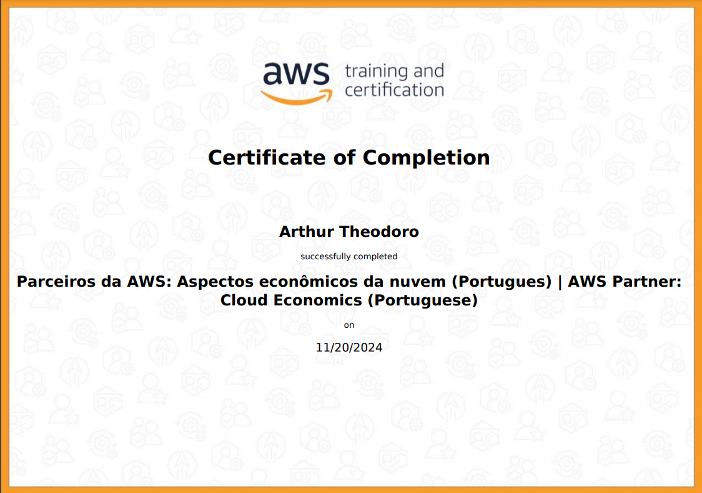

<h1 align="center">README Sprint 3</h1>

# Instruções

Este arquivo será o relato da sua entrega. Neste arquivo você fará a organização geral ao longo da Sprint. Esperamos que haja, minimamente:

- Uma ou mais seções para descrever o que estiver aprendendo (resumo), de maneira estruturada.

- Breve conteúdo de cada pasta relacionada a sprint.

# Resumo

### Python: 
Ao aprendi a base da linguagem Python, conseguindo assim me aprofundar em áreas mais avançadas, desenvolvendo habilidades em programação orientada a objetos. Isso me permitiu criar aplicações mais estruturadas e eficientes. Além disso, adquiri competências em manipulação, tratamento e filtragem de dados utilizando a biblioteca Pandas, que é essencial para análise de dados. Com esses dados processados, aprendi a visualizá-los de forma eficaz através de gráficos utilizando a biblioteca Matplotlib, permitindo a apresentação clara de informações complexas.

### AWS:
Aprendi os conceitos fundamentais de economia na nuvem. Aprendi a identificar oportunidades de economia de custos, a compreender a estrutura de preços da AWS e a aplicar melhores práticas para otimizar gastos na nuvem.

# Exercícios

1. [Resposta Exercício 1.](./Exercicios/Exercicio1.py)
2. [Resposta Exercício 2.](./Exercicios/Exercicio2.py)
3. [Resposta Exercício 3.](./Exercicios/Exercicio3.py)
4. [Resposta Exercício 4.](./Exercicios/Exercicio4.py)
5. [Resposta Exercício 5.](./Exercicios/Exercicio5.py)
6. [Resposta Exercício 6.](./Exercicios/Exercicio6.py)
7. [Resposta Exercício 7.](./Exercicios/Exercicio7.py)
8. [Resposta Exercício 8.](./Exercicios/Exercicio8.py)
9. [Resposta Exercício 9.](./Exercicios/Exercicio9.py)
10. [Resposta Exercício 10.](./Exercicios/Exercicio10.py)
11. [Resposta Exercício 11.](./Exercicios/Exercicio11.py)
12. [Resposta Exercício 12.](./Exercicios/Exercicio12.py)
13. [Resposta Exercício 13.](./Exercicios/Exercicio13.py)
14. [Resposta Exercício 14.](./Exercicios/Exercicio14.py)
15. [Resposta Exercício 15.](./Exercicios/Exercicio15.py)
16. [Resposta Exercício 16.](./Exercicios/Exercicio16.py)
17. [Resposta Exercício 17.](./Exercicios/Exercicio17.py)
18. [Resposta Exercício 18.](./Exercicios/Exercicio18.py)
19. [Resposta Exercício 19.](./Exercicios/Exercicio19.py)
20. [Resposta Exercício 20.](./Exercicios/Exercicio20.py)
21. [Resposta Exercício 21.](./Exercicios/Exercicio21.py)
22. [Resposta Exercício 22.](./Exercicios/Exercicio22.py)
23. [Resposta Exercício 23.](./Exercicios/Exercicio23.py)
24. [Resposta Exercício 24.](./Exercicios/Exercicio24.py)
25. [Resposta Exercício 25.](./Exercicios/Exercicio25.py)
26. [Respostas Exercício de ETL](./Exercicios/ETL)

# Evidências

Todas as evidências estão diretamente correlacionadas com a resolução do desafio e foram utilizadas no [README do desafio](./Desafio/README.md) para ilustrar, através de imagens, os passos necessários que foram seguidos. Isso inclui cada etapa do processo, desde a identificação do problema até a implementação da solução.

# Certificados

Certificado do Curso AWS Partner: Cloud Economics

