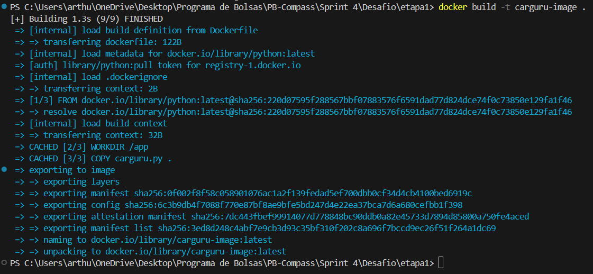
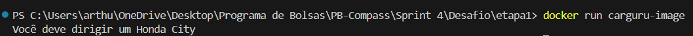
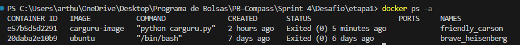
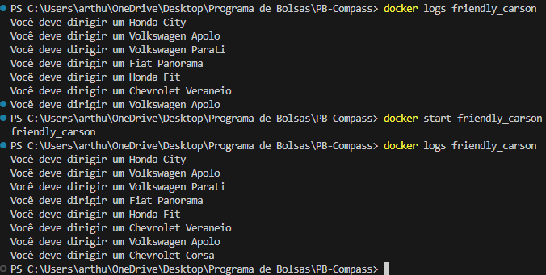
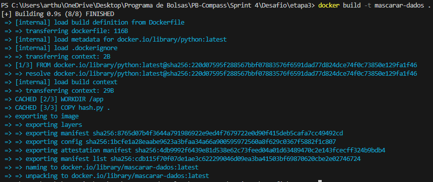
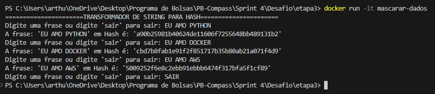

<h1 align="center">Resolução do Desafio ✍️</h1>

## 📝 Explicação sobre o desafio

- O desafio é dividido em 3 etapas:
    - Etapa 1: Criar uma imagem Docker que execute um código Python chamado "carguru.py" e, em seguida, iniciar um container a partir da imagem criada.
    - Etapa 2: Responder á seguinte pergunta: "É possível reutilizar containers" e fornecer uma justificativa para a resposta.
    - Etapa 3: Desenvolver um script Python que gere um código hash a partir de uma string recebida via input. A partir desse script, criar uma imagem Docker que o execute e, então, rodar um container interativo utilizando a imagem criada.

 ###

## Etapas


### Etapa 1

 #### Criando a imagem Docker que execute o código "carguru.py"
 - Código responsável pela criação da imagem: [Dockerfile](./etapa1/Dockerfile)
 
 - Segue a explicação linha por linha do arquivo Dockerfile, responsável por criar a imagem
    - ```` 
        FROM python
        ````
        - Essa linha especifica a imagem base que será utilizada para criar a nova imagem Docker, que no caso é a imagem oficial do Python pois o arquivo que será executado é um .py
    
    - ```` 
        WORKDIR /app 
        ````
        - Essa linha cria o diretório de trabalho "/app" dentro do container que executar essa imagem

    - ```` 
        COPY carguru.py .
        ````
        - Essa linha é responsável por criar uma cópia do arquivo "carguru.py" para dentro do diretório "/app" criado anteriormente

    - ```` 
        CMD ["python", "carguru.py"]
        ````
        - Essa linha é a responsável por efetivamente executar o arquivo "carguru.py". Ela executa  primeito o interpretador python, para após isso rodar o arquivo desejado.

###
- Após a criação do arquivo Dockerfile acima, foi necessário a utilizar o comando ``docker build`` no terminal para efetivamente criar a imagem

    - Evidência da execução do comando docker build
        - 
    - no caso, utilizei a flag -t para dar um nome a imagem. O "." no final da linha representa que o Docker deve usar o Dockerfile localizado no diretório atual para construir a imagem.

 #### Executando um container a partir da imagem criada

- Com a imagem criada, foi possível executar um container a partir dela
    - Evidência da execução do container a partir da imagem carguru-image
        - 
    - A saída da execução representa que o arquivo "carguru.py" foi executado com sucesso.


### Etapa 2

- É possível reutilizar containers?
    - Sim, é possível reutilizar containers no Docker. Quando um container é criado e executado, ele fica no estado parado após a sua execução, mas ainda fica disponível para ser reiniciado. Inclusive, todas as configurações e alterações feitas dentro do container durante sua execução são mantidas.

- Evidência da reutilização de um container:
    - Containers anteriormente criados:
        - 
        - Reutilizando o container cujo nome é "friendly_carson"
            - 
            - Na imagem acima, podemos ver inicialmente todas as saidas do container "friendly_carson", exibidas utilizando o ``docker logs``. Após a execução do comando ``docker start``, que é responsável por iniciar um container parado, podemos perceber, com um novo uso do ``docker logs``, que uma nova saída foi adicionada ao log, ou seja, o container foi reutilizado com sucesso.


### Etapa 3

#### Desenvolvimento de um script Python que gere um código hash a partir de uma string recebida via input

- Código do Script: [hash.py](../Desafio/etapa3/hash.py)
###
- Explicação do código
    - Lógica:
        - A lógica utilizada se baseia no seguinte: Um looping while, que em toda interação recebe via input uma string. Enquanto a string não tiver o valor "sair" ele transforma a string em um código hash e a imprime para o usuário. Após a impressão o processo se repete.
        ###
    - Transformação para hash    
    - ````
        string_para_hash = hashlib.sha1(string.encode()).hexdigest()
        ````
        - O Python possui um módulo nativo chamado ``hashlib``, nele há funções prontas que transformam bytes em código hash
        - No trecho de código acima, podemos ver o módulo sendo utilizado
        - ``.sha1``: É uma função do módulo hashlib que cria um objeto de hash SHA-1.
        - `` string.encode() ``: Converte a string de entrada em uma sequência de bytes, para que assim a função hash possa operar corretamente
        - ``.hexdigest()``: Método responsável por retornar a representação hexadecimal da saída da função.
###

#### Criação da Imagem mascarar-dados

- Uma vez que o script foi criado, agora é possível criar a imagem que irá utilizá-lo

- Código responsável pela criação da imagem: [Dockerfile](./etapa3/Dockerfile)
 
- Segue a explicação linha por linha do arquivo Dockerfile, responsável por criar a imagem
    - ```` 
         FROM python
        ````
     - Essa linha especifica a imagem base que será utilizada para criar a nova imagem Docker, que no caso é a imagem oficial do Python pois o arquivo que será executado é um .py
    
    - ```` 
         WORKDIR /app 
        ````
    - Essa linha cria o diretório de trabalho "/app" dentro do container que executar essa imagem

     - ```` 
        COPY hash.py .
         ````
    - Essa linha é responsável por criar uma cópia do arquivo "hash.py" para dentro do diretório "/app" criado anteriormente

    - ```` 
        CMD ["python", "hash.py"]
        ````
    - Essa linha é a responsável por efetivamente executar o arquivo "hash.py". Ela executa  primeito o interpretador python, para após isso rodar o arquivo desejado.

###

- Após a criação do arquivo Dockerfile acima, foi necessário a utilizar o comando ``docker build`` no terminal para efetivamente criar a imagem

    - Evidência da execução do comando docker build
        - 
    - no caso, utilizei a flag -t para dar um nome a imagem. O "." no final da linha representa que o Docker deve usar o Dockerfile localizado no diretório atual para construir a imagem.

 #### Executando um container interativo a partir da imagem mascarar-dados

- Com a imagem criada, foi possível executar um container interativo a partir dela
    - Evidência da execução do container a partir da imagem carguru-image
        - 
    - A flag ``-it`` na criação do container o torna interativo, o que permite o usuário a digitar entradas para o arquivo que está sendo executado pela imagem dele.
    - É possível perceber que para todas as 3 entradas o código retornou corretamente o código hash SHA-1 que representa aquela string
    - A saída da execução representa que o arquivo "hash.py" foi executado com sucesso.