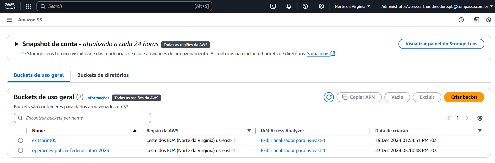
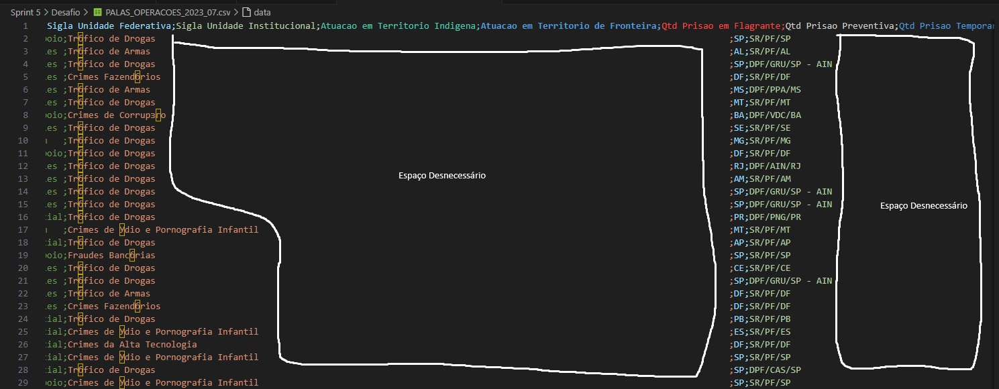
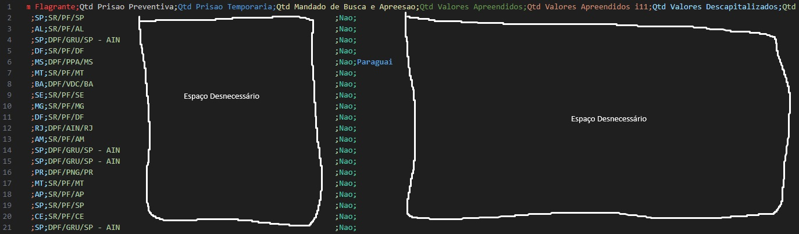
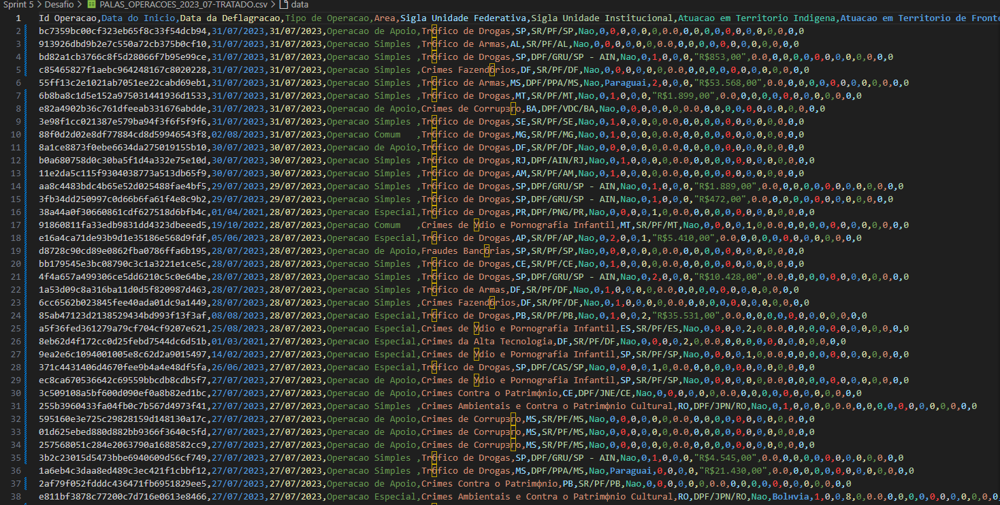
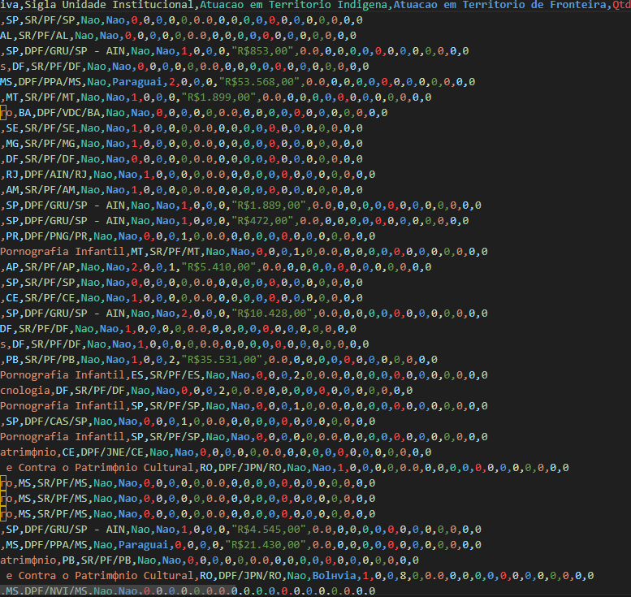
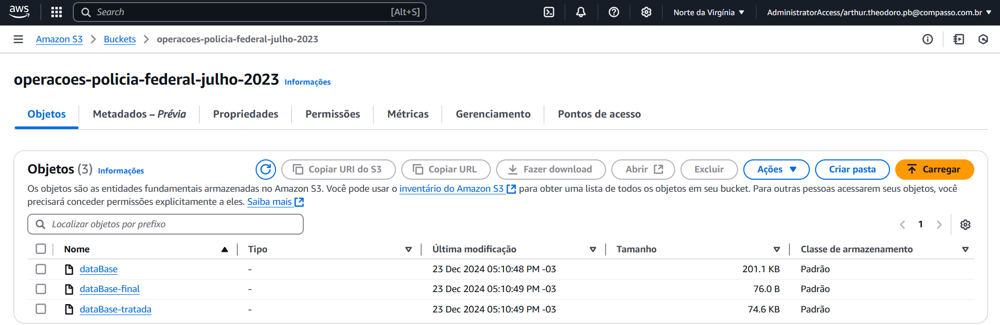

<h1 align="center">Resolução do Desafio ✍️</h1>

### 📝 Explicação sobre o desafio

O objetivo deste desafio é utilizar o serviço S3 da AWS para armazenar dados públicos do Governo Brasileiro e, em seguida, manipulá-los com funções específicas para obter uma resposta única a uma pergunta feita a esse conjunto de dados. O armazenamento dos dados no S3 será realizado com o boto3, enquanto a manipulação dos dados será feita utilizando pandas.

### Arquivo Utilizado

- O arquivo do governo que eu escolhi para realizar esse desafio se chama ["PALAS_OPERACOES_2023_07"](../Desafio/PALAS_OPERACOES_2023_07.csv).
- Esse arquivo de dados contém informações sobre todas as operações da Polícia Federal que foram deflagradas em julho de 2023. Ele contém 466 linhas e 27 colunas.

### Carregando Arquivo para um Bucket novo a partir de um script Python

- Para carregar o arquivo para um novo bucket do serviço AWS S3, primeiramente foi necessário criar um script Python que realizasse as seguintes funções:            
    - Criasse um bucket
    - Fizesse upload do arquivo CSV para o bucket
###
- Utilizando a biblioteca Python boto3 foi possível criar esse script

    #### Criação do Script
    - Neste script, optei por criar funções para criar o bucket e enviar os arquivos para ele, visando utilizá-las posteriormente no script Python que manipula e trata o arquivo CSV.

    #### Criação do Bucket
    - A bilbioteca boto3 tem um método responsável por criar um bucket S3, chamado ``.create_bucket``. Para utiliza-lo é necessário configurar um "boto3 client" que interaja com o serviço S3 e tenha acesso as credenciais necessárias para isso. 
        - Código da criação do boto3 client
            - ````
                s3 = boto3.client(
                    's3',
                    aws_access_key_id = AWS_ACCESS_KEY_ID,
                    aws_secret_access_key = AWS_SECRET_ACCESS_KEY,
                    aws_session_token = AWS_SESSION_TOKEN
                )
                ````
    ###
    - Após a criação do cliente, foi possível desenvolver a função que cria o bucket S3. Essa função exige como argumento o nome do bucket a ser criado, que é um requisito obrigatório.
        - Código da função que cria o bucket S3
            - ````
                def create_bucket(bucket_name):
                    s3.create_bucket(
                        Bucket= bucket_name,
                    )
                ````
        #### Upload dos Arquivos
        - Desenvolvi uma função que faz o upload de um arquivo para um bucket S3. Essa função exige como argumento o caminho do arquivo que sofrerá upload, o nome do bucket no qual o arquivo será armazenado e com qual nome o arquivo irá ficar no bucket.
            - Código da função que faz upload do arquivo.
                - ````
                    def upload_to_s3(path, bucket_name, file_name):
                        s3.upload_file(path, bucket_name, file_name)
                    ````
    ###             
    - Ambas as funções acima só foram efetivamente usadas no arquivo [tratamento-manipulacao.py](../Desafio/tratamento-manipulacao.py). Esse é o script responsável pelo tratamento e manipulação dos dados, e é nele que o bucket de nome "operacoes-policia-federal-julho-2023" é criado e o arquivo CSV que originalmente contém os dados é upado para o bucket.
        - Uso da função que cria o bucket e que upa os arquivos
            - ````
                import S3 

                #Criando bucket
                S3.create_bucket("operacoes-policia-federal-julho-2023")

                #Subindo para o S3 o arquivo CSV original
                S3.upload_to_s3(r"C:\Users\arthu\OneDrive\Desktop\Programa de Bolsas\PB-Compass\Sprint 5\Desafio\PALAS_OPERACOES_2023_07.csv",  "operacoes-policia-federal-julho-2023", "dataBase")
                ````
    - Evidência criação do Bucket:
    - 

### Tratamento dos dados

- Para começar o tratamento dos dados, foi necessário criar um dataFrame no pandas
    - Criação do DataFrame
        - ````
            #Criando o DataFrame
            dados = pd.read_csv(r"C:\Users\arthu\OneDrive\Desktop\Programa de Bolsas\PB-Compass\Sprint 5\Desafio\PALAS_OPERACOES_2023_07.csv", delimiter=";")
            ```` 
###

- Após a criação do DataFrame, comecei a analisar os dados e percebi que algumas colunas do DataFrame possuem alguns espaços desnecessários, então decidi usar o str.strip() para tira-los e além disso, substitui todos os vazios e nulos por 0

    - Espaços em desnecessários:
    - 
    - 

    - Código que retira os espaços desnecessários e substitui os vazios e nulos por 0
    - `````
        dados["Area"] = dados["Area"].str.strip()
        dados["Sigla Unidade Institucional"] = dados["Sigla Unidade Institucional"].str.strip()
        dados["Atuacao em Territorio de Fronteira"] = dados["Atuacao em Territorio de Fronteira"].str.strip()

        dados.replace("", "0", inplace=True)
        dados.fillna(0, inplace=True)
        ``````

    - DataFrame sem os espaços Desnecessários e com os nulos e vazios substituidos por 0:
    - 

###

- Percebi que a Coluna "Atuacao em Territorio de Fronteira" ficaria mais legível caso os "0" fossem substituidos por "Nao", então fiz essa substituição:
    - Código da substituição dos 0 por "Nao" na coluna "Atuacao em Territorio de Fronteira"
        - ````
            dados["Atuacao em Territorio de Fronteira"] = dados["Atuacao em Territorio de Fronteira"].astype(str)
            dados["Atuacao em Territorio de Fronteira"] = dados["Atuacao em Territorio de Fronteira"].replace("0", "Nao")
            ````
    
    - Coluna "Atuacao em Territorio de Fronteira" após substituição:
    - 

- Após o tratamento acima, exportei o DataFrame tratado para o formato CSV e fiz o upload dele para o S3
    - Código da exportação para CSV
        - ````
            dados.to_csv(r"C:\Users\arthu\OneDrive\Desktop\Programa de Bolsas\PB-Compass\Sprint 5\Desafio\PALAS_OPERACOES_2023_07-TRATADO.csv", index=False, encoding='utf-8')
            ````
    - Código do Upload para o S3
        - ``````
            S3.upload_to_s3(r"C:\Users\arthu\OneDrive\Desktop\Programa de Bolsas\PB-Compass\Sprint 5\Desafio\PALAS_OPERACOES_2023_07-TRATADO.csv", "operacoes-policia-federal-julho-2023", "dataBase-tratada")
            ``````

### Manipulação dos Dados

- A pergunta que eu busquei responder com a manipulação dos dados foi:
    - "Qual é o total de valores apreendidos nas operações da Polícia Federal que foram deflagradas na primeira quinzena de Julho, que tiveram prisão em flagrante e tiveram mandato de busca e apreensão?"

- Nessa parte, era obrigatório o uso das seguintes funções:
    - Clausula que filtra dados usando ao menos dois operadores lógicos
    - Duas Funções de Agregação
    - Uma Função Condicional
    - Uma Função de Conversão 
    - Uma Função de Data
    - Uma função de 
    
###
    
- Então para usar todas as funções e conseguir responder a pergunta de forma satisfatória, segui a seguinte lógica:

###
- Utilizei primeiramente a clausula que filtra dados usando dois operadores lógicos para filtrar somente as operações que tiveram mandato de busca apreensão e prisão em flagrante.
    - Código:
        - ````
            resultado = dados[(dados["Qtd Prisao em Flagrante"] != 0) & (dados["Qtd Mandado de Busca e Apreesao"] != 0)]
            ````

###

- Em seguida, usei a função de conversão ``astype(str)`` para transformar a coluna "Qtd Valores Apreendidos" em string e assim conseguir usar a função de string ``str.replace()``, para substituir qualquer caracter especial em espaço vazio, e a função de string ``str.strip()``, para retirar qualquer espaço em branco que a string contenha.
    - Código:
        - ``````
            resultado.loc[:, "Qtd Valores Apreendidos"] = resultado["Qtd Valores Apreendidos"].astype(str).str.replace("R$", "").str.replace(".", "").str.replace(",", ".").str.strip()
            ``````

- Uma vez que a coluna "Qtd Valores Apreendidos" está no formatada como string, sem espaços desnecessários e sem caracteres especiais, foi possível utilizar a função ``pd.to_numeric()`` para transforma-la para o formato de dados float
    - Código:
        - ``````
            resultado.loc[:,"Qtd Valores Apreendidos"] = pd.to_numeric(resultado["Qtd Valores Apreendidos"], errors='coerce', downcast='float')
            ``````

###
- Com os dois primeiros filtros aplicados, e a coluna "Qtd Valores Apreendidos" transformada para float, foi possível utilizar a função condicional ``query()`` para filtrar somente as operações que tiveram valores apreendidos
    - Código:
        - ``````
            resultado = resultado.query('`Qtd Valores Apreendidos` > 0')
            ``````
###
- O quarto passo, foi filtrar apenas as operações que foram deflagradas na primeira quinzena de julho, e nesse filtro, a função de data será usada.
    - Para conseguir filtrar corretamente as operações, primeiramente transformei a coluna "Data da Deflegracao" para o formato DateTime utilizando a função de data ``pd.to_datetime()``
    - Após isso, defini a data limite como "2023-07-16"
    - E, por final, apliquei o filtro para que somente as operações que foram deflagradas em uma data menor que a data limite permanecessem no dataset. 

    - Código:
        - `````
            resultado["Data da Deflagracao"] = pd.to_datetime(resultado["Data da Deflagracao"], dayfirst=True)
            data_limite = pd.to_datetime('2023-07-16')
            resultado = resultado[resultado["Data da Deflagracao"] < data_limite]
            ``````

###
- Por último, utilizei a função de agregação ``count()``, para contar quantas operações se enquadraram nas restrições que a pergunta criou, e a função de agregação ``sum()``, para descobrir qual a quantidade total de valores apreendidos por essas operações.
    - Código:
        - ``````
            total_operacoes = resultado["Id Operacao"].count()
            total_valores_apreendidos = resultado["Qtd Valores Apreendidos"].sum()
            ``````

- Após finalizar a manipulação, criei um dataFrame que contem como coluna: "Quantidade Total de Operações" e "Valor Total Apreendido". Como linha, esse dataFrame contém o total de operações e o total de valores apreendidos. Com esse dataFrame criado, foi possível exporta-lo como CSV e upar esse CSV com os resultados finais para o bucket S3.
    - Código:
        - ``````
            total_valores_apreendidos_formatado = f"{total_valores_apreendidos:,.1f}"

            #Saída final
            totais = [[total_operacoes, f"R${total_valores_apreendidos_formatado}"]]

            #Exportando saída final para um CSV
            dados_final = pd.DataFrame(totais, columns=["Quantidade Total de Operações", "Valor Total Apreendido"])
            dados_final.to_csv(r"C:\Users\arthu\OneDrive\Desktop\Programa de Bolsas\PB-Compass\Sprint           5\Desafio\PALAS_OPERACOES_2023_07-Final.csv", index=False, encoding='utf-8')

            #Subindo para o S3 o CSV final
            S3.upload_to_s3(r"C:\Users\arthu\OneDrive\Desktop\Programa de Bolsas\PB-Compass\Sprint 5\Desafio\PALAS_OPERACOES_2023_07-Final.csv", "operacoes-policia-federal-julho-2023", "dataBase-final")
            ``````

- Evidência de Upload de todos os arquivos para o S3
-  
