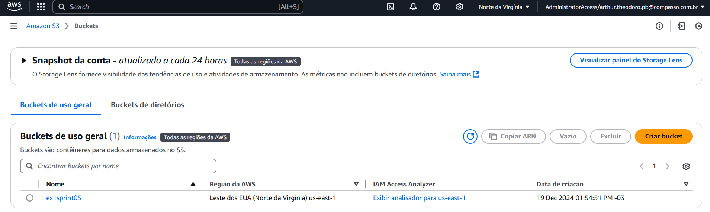
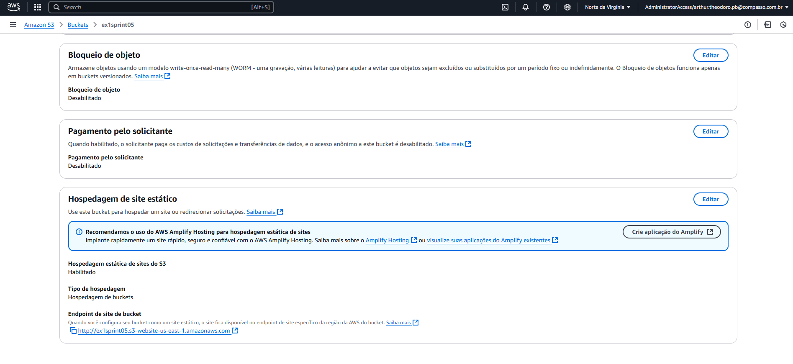
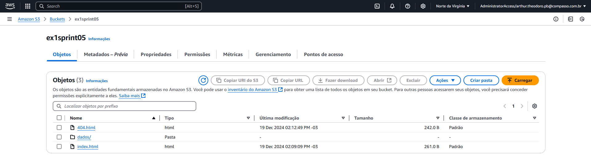
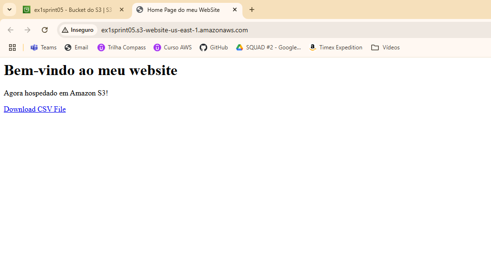
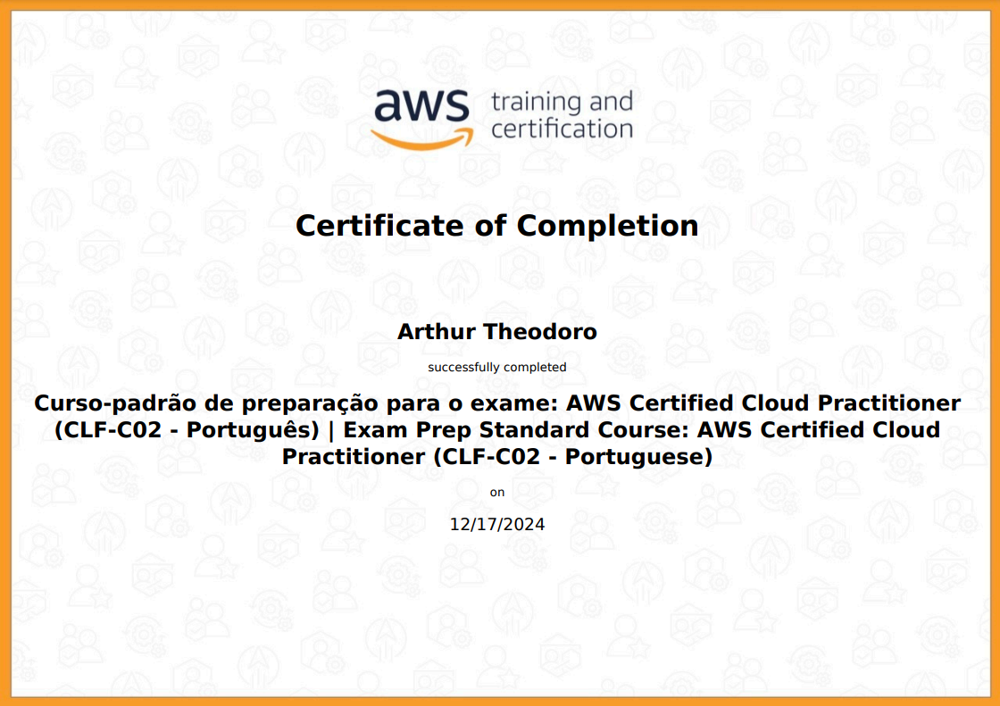

<h1 align="center">README Sprint 5</h1>

# Instruções

Este arquivo será o relato da sua entrega. Neste arquivo você fará a organização geral ao longo da Sprint. Esperamos que haja, minimamente:

- Uma ou mais seções para descrever o que estiver aprendendo (resumo), de maneira estruturada.

- Breve conteúdo de cada pasta relacionada a sprint.

# Resumo

### AWS:
A experiência com o Cloud Quest me permitiu explorar os principais serviços da AWS, como o EC2 e o S3, que são essenciais para o dia a dia de um engenheiro de software. Além disso, aprendi a hospedar um site estático no S3, criar e excluir buckets, além de utilizá-los para o armazenamento de arquivos.

### Python 
Continuei meu aprendizado em Python e Pandas, revisando a manipulação e tratamento de DataFrames e aprofundando meu conhecimento na biblioteca. Aprendi novas funções e funcionalidades, o que foi extremamente enriquecedor. Transformar um conjunto de dados bruto em um formato otimizado para análise de dados e ser capaz de manipular dados para responder a perguntas foi uma experiência valiosa.

# Exercícios

### Evidência de Execução do Exercício 1
- Criação do Bucket:
    - 

- Hospegadem do Site Estático:
    - 

- Upload Correto dos Arquivos para o Bucket:
    - 

- Site Estático rodando: 
    - 

# Evidências

Todas as evidências estão diretamente correlacionadas com a resolução do desafio e foram utilizadas no [README do desafio](./Desafio/README.md) para ilustrar, através de imagens, os passos necessários que foram seguidos. Isso inclui cada etapa do processo, desde a identificação do problema até a implementação da solução.

# Certificados

- [AWS Cloud Quest: Cloud Practitioner](https://www.credly.com/badges/13fece18-9c7c-4173-a111-9a1e7577b5b5/public_url)

- Certificado curso padrão de preparação para o exame: AWS Certified Cloud Practitioner 
    - 

