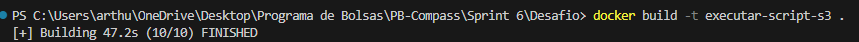
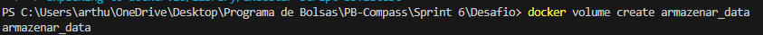
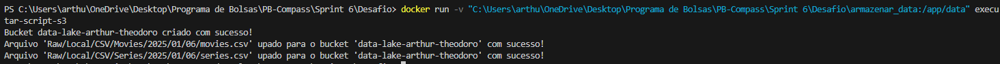
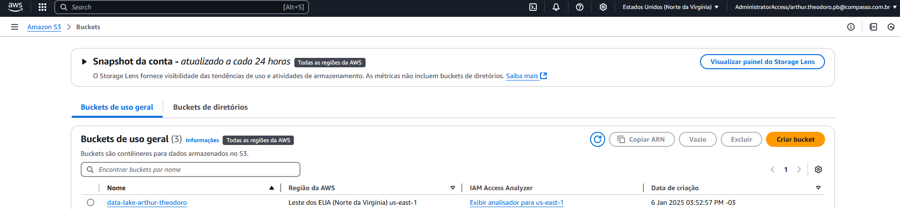
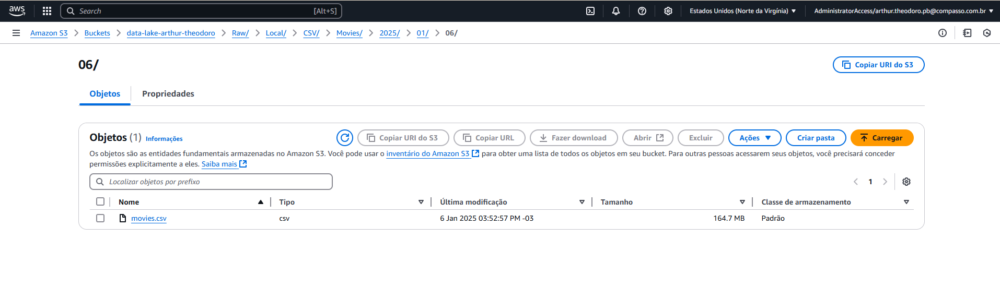
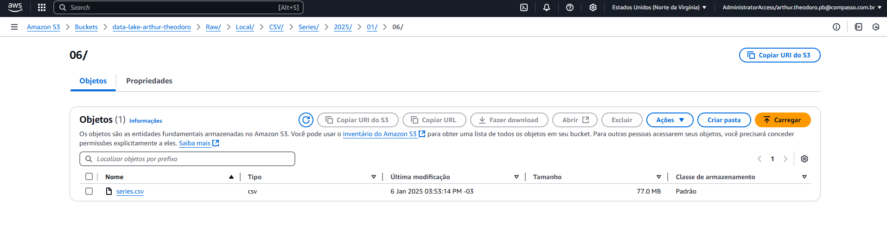

<h1 align="center">Resolução do Desafio ✍️</h1>

### 📝 Explicação sobre o desafio

O objetivo deste desafio é iniciar o desafio final do programa de bolsas. O primeiro passo consiste em formular perguntas para a base de dados, de modo que todo o restante do desafio final seja orientado por essas questões. Em seguida, iniciamos o desafio propriamente dito com a ingestão dos arquivos CSV. Esses arquivos são armazenados em um Bucket Amazon S3 na Raw Zone, utilizando um código Python executado em um container Docker para transferir os dados locais para a nuvem.

### Minhas Perguntas

1. Quais são os filmes de crime/guerra com as maiores notas médias?
    Motivo: Identificar quais filmes do gênero crime/guerra receberam as melhores avaliações.


2. Qual o tempo médio de duração dos filmes de crime/guerra lançados entre 2000 e 2020?
    Motivo: Analisar a tendência de duração dos filmes desse gênero ao longo dos anos.


3. Quais artistas fizeram mais series de crime/guerra e quais personagens eles interpretaram?
    Motivo: Descobrir artistas influentes no gênero e seus papéis típicos.


4. Há correlação entre o número de votos que um filme de crime/guerra recebe e sua nota média?
    Motivo: Analisar se filmes mais votados tendem a ter notas mais altas ou baixas.


5. Quais são as séries de crime/guerra mais conhecidos de cada década?
    Motivo: Identificar títulos de destaque em diferentes períodos

### Script Python

- O objetivo do [Script Python](./S3.py) foi criar um bucket com RAW zone e armazenar os arquivos "movies.csv" e "series.csv" nele.

- O primeiro passo para isso foi importar a biblioteca boto3, responsável por interagir com os serviços da AWS através do python.

- Com a biblioteca boto3 importada, foi possível criar um cliente boto3, que interaja com o serviço AWS S3, utilizando o método ``.client()``. 
    - Código da criação do boto3 client
        - ````
            s3 = boto3.client(
                's3',
                aws_access_key_id = AWS_ACCESS_KEY_ID,
                aws_secret_access_key = AWS_SECRET_ACCESS_KEY,
                aws_session_token = AWS_SESSION_TOKEN
            )
            ````
    ###
- Após a criação do cliente, foi possível desenvolver a função que cria o bucket S3. Essa função exige como argumento o nome do bucket a ser criado, que é um requisito obrigatório. Além disso, utilizei o ``try excepet`` para tratar os erros e exibir uma mensagem no caso de sucesso.
    - Código da função que cria o bucket S3
        - ````
            def create_bucket(bucket_name):
                try:
                    s3.create_bucket(Bucket= bucket_name)
                except Exception as error:
                    print(f"Não foi possível criar o Bucket: {error}")
                else:
                    print(f"Bucket {bucket_name} criado com sucesso!")
            ````
###
- Com o bucket cirado, foi possível desenvolver a função que faz o upload dos arquivos para o S3. Essa função exige como argumento o caminho do arquivo que sofrerá upload, o nome do bucket no qual o arquivo será armazenado e com qual nome o arquivo irá ficar no bucket. Além disso, utilizei o ``try excepet`` para tratar os erros e exibir uma mensagem no caso de sucesso.
    - Código da função que faz upload do arquivo.
         - ````
            def upload_to_s3(path, bucket_name, file_name):
                try:
                    s3.upload_file(path, bucket_name, file_name)
                except Exception as error:
                    print(f"Erro ao upar arquivo: {error}")
                else:
                    print(f"Arquivo '{file_name}' upado para o bucket '{bucket_name}' com sucesso!")

            ````
###
- Com ambas as funções criadas, primeiramente invoquei a ``create_bucket()`` para criar o bucket S3
    - Código da criação do bucket:
        - ````
            bucket_name = "data-lake-arthur-theodoro"
            create_bucket(bucket_name)
            ``````
###
- Após criar o bucket, fiz o upload dos arquivos para o S3 usando a função ``upload_to_s3``, seguindo a estrutura da Raw Zone, que requer uma organização específica de pastas incluindo a data do sistema no momento do upload. Para obter a data atual, utilizei o método ``now()`` da biblioteca datetime e, para formatá-la conforme necessário, usei o método ``strftime()`` da mesma biblioteca.
    - Código do upload dos arquivos:
        - ``````
            #Definindo nome das pastas para upar os arquivos
            hoje = dt.datetime.now().strftime("%Y/%m/%d")
            pastas_movies = f"Raw/Local/CSV/Movies/{hoje}"
            pastas_series = f"Raw/Local/CSV/Series/{hoje}"

            #Upando arquivo movies.csv
            upload_to_s3(r"/app/data/movies.csv", bucket_name, f"{pastas_movies}/movies.csv")

            #Upando arquivo series.csv
            upload_to_s3(r"/app/data/series.csv", bucket_name, f"{pastas_series}/series.csv")
            ``````

### Docker

- Com o Script python criado, foi necessário criar uma imagem e um container no Docker com um volume para armazenar os arquivos CSV e executar o processo Python implementado.

 - Código responsável pela criação da imagem: [Dockerfile](./Dockerfile)
 
 - Segue a explicação linha por linha do arquivo Dockerfile, responsável por criar a imagem
    - ```` 
        FROM python
        ````
        - Essa linha especifica a imagem base que será utilizada para criar a nova imagem Docker, que no caso é a imagem oficial do Python pois o arquivo que será executado é um .py
    
    - ```` 
        WORKDIR /app 
        ````
        - Essa linha cria o diretório de trabalho "/app" dentro do container que executar essa imagem

    - ```` 
        COPY COPY S3.py .
        ````
        - Essa linha é responsável por criar uma cópia do arquivo "S3.py" para dentro do diretório "/app" criado anteriormente

    - ````
        RUN pip install boto3 
        ``````
        - Essa linha é responsável por instalar a biblioteca boto3 no ambiente docker que será criado

    - ```` 
        CMD ["python", "S3.py"]
        ````
        - Essa linha é a responsável por efetivamente executar o arquivo "S3.py". Ela executa  primeito o interpretador python, para após isso rodar o arquivo desejado.

###

- Após a criação do arquivo Dockerfile acima, foi necessário a utilizar o comando ``docker build`` no terminal para efetivamente criar a imagem

    - Evidência da execução do comando docker build
    
    - no caso, utilizei a flag -t para dar um nome a imagem. O "." no final da linha representa que o Docker deve usar o Dockerfile localizado no diretório atual para construir a imagem.

###

- Após a criação da imagem e antes da criação do container, utilizei o comando ``docker volume create`` para criar um volume docker, responsável por armazenar os arquivos que serão lidos pelo script python
    - Evidência da criação do volume
    
 #### Executando um container a partir da imagem criada

- Com a imagem e o volume criados, foi possível executar um container utilizando-os.
    - Evidência da execução do container a partir da imagem "executar-script-s3"
        - 
    - A saída da execução representa que o arquivo "executar-script-s3" foi executado com sucesso.

###
- Com a execução correta do script python, um bucket S3 foi criado e os arquivos foram upados para ele, seguindo a estrutura da Raw Zone.

    - Evidência da criação do bucket:
    
    - Evidência do arquivo "movies.csv" upado para o bucket seguindo a estrutura Raw Zone
    
    - Evidência do arquivo "series.csv" upado para o bucket seguindo a estrutura Raw Zone
    