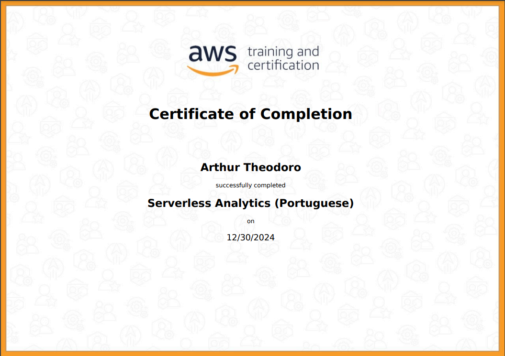
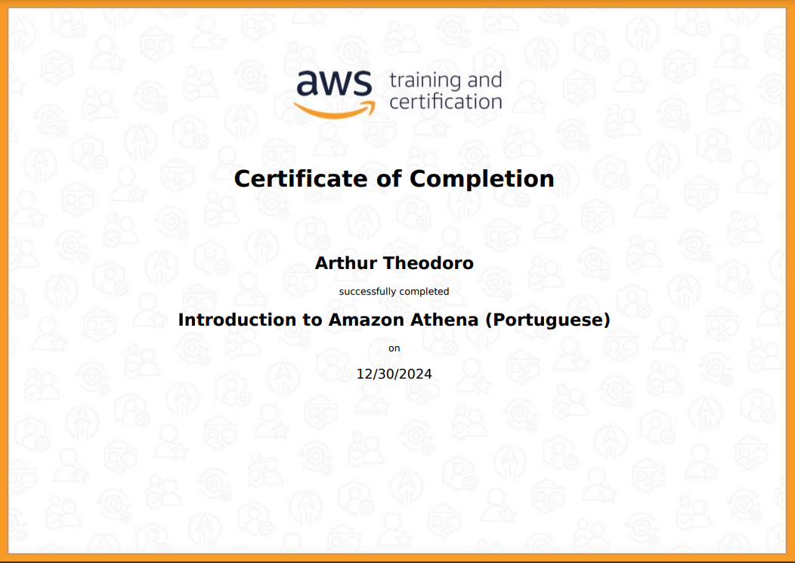
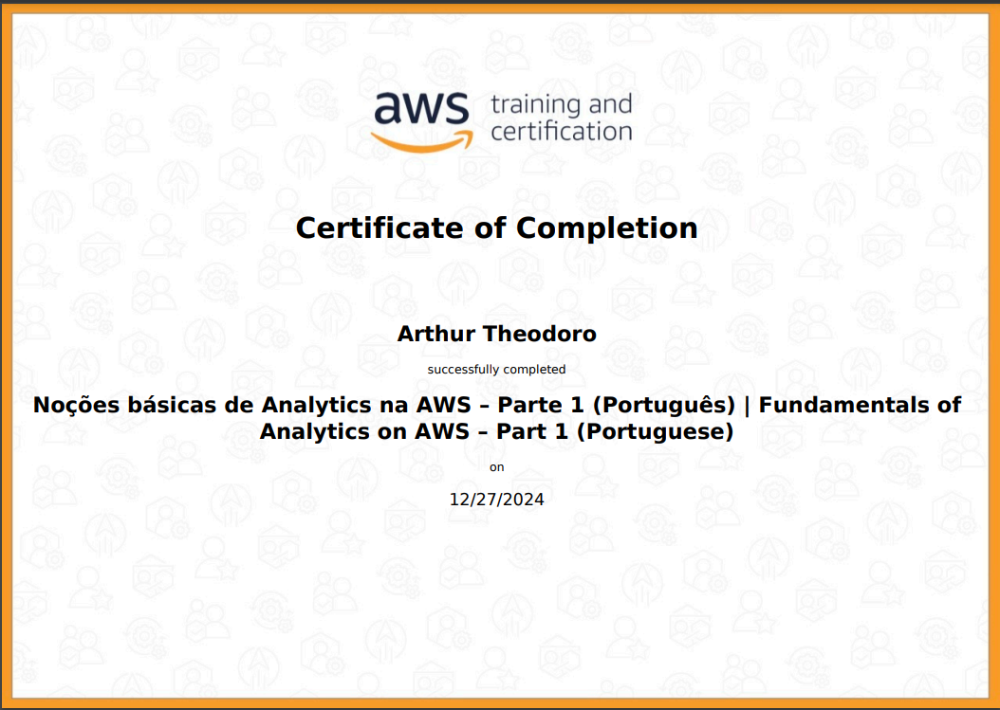

<h1 align="center">README Sprint 6</h1>

# Instruções

Este arquivo será o relato da sua entrega. Neste arquivo você fará a organização geral ao longo da Sprint. Esperamos que haja, minimamente:

- Uma ou mais seções para descrever o que estiver aprendendo (resumo), de maneira estruturada.

- Breve conteúdo de cada pasta relacionada a sprint.

# Resumo

### AWS
Durante essa sprint, devido aos vários cursos, irei resumir o que aprendi de forma integrada, sem entrar em detalhes sobre cada curso individualmente. Os cursos foram extremamente proveitosos, pois juntos proporcionaram uma excelente compreensão sobre armazenamento, processamento, análise e monitoramento de dados na nuvem. Eles destacaram os principais serviços da AWS para cada uma dessas funções, oferecendo uma breve introdução a cada serviço e demonstrando, na prática, como cada um opera.
# Exercícios
Na pasta [Exercícios](../Sprint%206/Exercicios/), há a execução sequencial de cada um. Ela inclui evidências das etapas realizadas e os arquivos utilizados nos três exercícios.

- [Evidência de execução Exercício 1](../Sprint%206/Exercicios/.evidencias-ex1)
- [Evidência de execução Exercício 2](../Sprint%206/Exercicios/.evidencias-ex2)
- [Evidência de execução Exercício 3](../Sprint%206/Exercicios/.evidencias-ex3)

# Evidências

Todas as evidências estão diretamente correlacionadas com a resolução do desafio e foram utilizadas no [README do desafio](./Desafio/README.md) para ilustrar, através de imagens, os passos necessários que foram seguidos. Isso inclui cada etapa do processo, desde a identificação do problema até a implementação da solução.

# Certificados

- Amazon EMR Getting Started

- Amazon QuickSight - Getting Started

- AWS Glue Getting Started

- AWS-Serveless-Analytics

- Best Practices for Data Warehousing with Amazon Redshift

- Fundamentos de analytics na AWS P2

- Getting Started with Amazon Redshift

- Introduction-To-Amazon-Athena

- Nocoes-basicas-de-Analytics-na-AWS–P1

