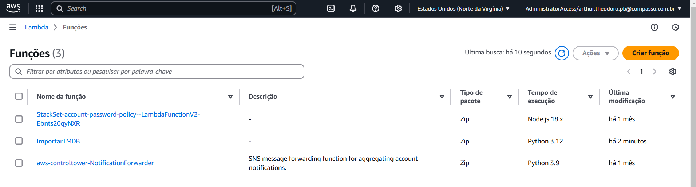
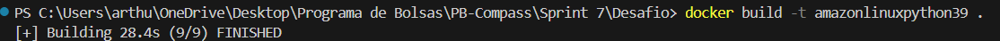
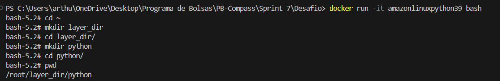
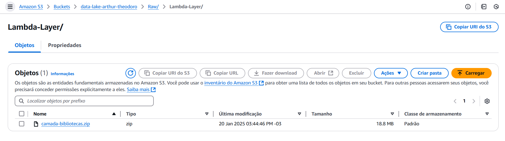
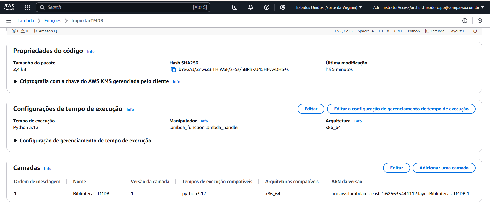
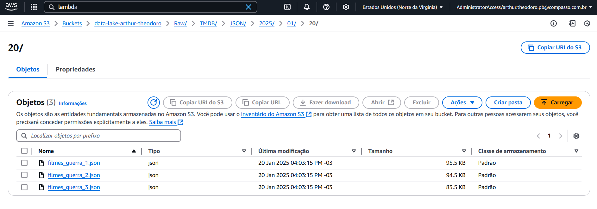

<h1 align="center">Resolução do Desafio ✍️</h1>

### 📝 Explicação sobre o desafio

O objetivo deste desafio foi requisitar dados da API do TMDB para complementar a análise do desafio final, utilizando o Lambda, e armazenar as informações extraídas na Raw Zone do Amazon S3.

### Minhas Perguntas para o desafio final

- Após uma análise mais detalhada dos dados disponíveis, tanto nos arquivos CSV quanto na API do TMDB, decidi ajustar minhas perguntas e escolher um tema para a análise. O tema que selecionei foi Guerra Fria, e as perguntas que pensei foram as seguintes:

1. Como a frequência de lançamentos de filmes de crime/guerra variou ao longo das décadas da Guerra Fria (1947-1991)?
 
2. Quais são os temas ou enredos mais comuns nos filmes de crime/guerra durante os momentos de maior tensão da Guerra Fria, como a Crise dos Mísseis de Cuba (1962) ou a Guerra do Vietnã (1955-1975)?
 
3. Qual o impacto da origem dos diretores e atores nos filmes de crime/guerra em relação ao tom e à representação dos personagens de diferentes nacionalidades?
 
4. Existe uma tendência nas produções de filmes de crime/guerra ao longo da Guerra Fria que reflete mudanças nas percepções públicas de ameaças internacionais, e como isso se manifesta nos personagens (protagonistas versus antagonistas)?
 
5. Quais foram os principais talentos (artistas e diretores) frequentemente associados a filmes de crime/guerra durante a Guerra Fria, e como suas contribuições moldaram o gênero?
 
### Criação do Código para consulta da API

- O [código](../Desafio/ImportarTMDB.py) tem por função buscar filmes da API do The Movie Database (TMDb) que pertencem ao gênero "guerra", cujo ID é 10752, e foram lançados entre 1947 e 2000, anos correspondentes a guerra fria. Decidi dividir ele nas seguintes etapas:

#### Configuração da API

- ``````
    # Configuracão inicial da API
    api_key = 'api-key'
    base_url = 'https://api.themoviedb.org/3/discover/movie'

    filtros = {
        'api_key': api_key,
        'language': 'pt-BR',
        'with_genres': '10752', 
        'primary_release_date.gte': '1947-01-01',
        'primary_release_date.lte': '2000-12-31',
        'sort_by': 'vote_count.desc'
    }

    ``````
    - Essa parte do código é responsável por definir os filtros utilizados na busca da API. Todos os filtros são armazenados no dicionário chamado filtros. Além disso, são declaradas a variável api_key, que contém a chave única de acesso à API, e a variável base_url, que armazena a URL base futuramente utilizada na requisição HTTP para obter os dados da API.

#### Configuração de acesso a AWS 
- ```````
    # Configurações de Acesso AWS
    AWS_ACCESS_KEY_ID="Key1"
    AWS_SECRET_ACCESS_KEY="Key2"
    AWS_SESSION_TOKEN="key3"
    s3_client = boto3.client(
        's3',
        aws_access_key_id=AWS_ACCESS_KEY_ID,
        aws_secret_access_key=AWS_SECRET_ACCESS_KEY,
        aws_session_token=AWS_SESSION_TOKEN
    )

    #Definindo nome das pastas para upar os arquivos e nome do bucket
    hoje = dt.datetime.now().strftime("%Y/%m/%d")
    estrutura_RAW = f"Raw/TMDB/JSON/{hoje}"
    bucket_name = "data-lake-arthur-theodoro"

    # Função para enviar dados ao S3
    def upload_to_s3(dados, nome_do_bucket, nome_arquivo):
        try:
            dados_json = json.dumps(dados, ensure_ascii=False, indent=4)
            s3_client.put_object(
                Bucket=nome_do_bucket,
                Key=f"{estrutura_RAW}/{nome_arquivo}.json",
                Body=dados_json 
            )
        except Exception as error:
            print(f"Erro ao enviar: {error}")
        else:
            print(f"Arquivo '{nome_arquivo}.json' enviado com sucesso!")
    ````````
    - Com a API configurada, decidi configurar tudo necessário para o acesso ao Amazon S3 através do Python, utilizando a biblioteca boto3, e para que os arquivos fossem armazenados no S3 no formato JSON e dentro da RAW zone. Isso é feito no código acima.
    - Primeiramente declarei as variáveis que armazenam as minhas credencias AWS, logo em seguida configuro o cliente boto 3, responsável por efetivamente acessar o serviço S3. 
    - Já com o cliente configurado, foi possível criar a função ``upload_to_S3``. A função upload_to_s3 converte os dados fornecidos em formato JSON e os envia para um bucket S3, tudo isso através do método ``put_object()``. Ela recebe três parâmetros: dados (informações a serem enviadas), nome_do_bucket (nome do bucket no S3) e nome_arquivo (nome do arquivo a ser salvo). Se o envio for bem-sucedido, imprime uma mensagem de sucesso; caso contrário, exibe um erro. 

#### Função responsável por buscar os filmes desejados na API

- ``````
    def buscar_filmes(limit=300):
    filmes = []
    num_pagina = 1
    while len(filmes) < limit:
        filtros['page'] = num_pagina
        query = requests.get(base_url, params=filtros)
        data = query.json()
        pagina_atual_filmes = data.get('results', [])
        
        filmes.extend(pagina_atual_filmes[:limit - len(filmes)])
        
        if len(pagina_atual_filmes) < 20:
            break 

        num_pagina += 1

    return filmes
    ``````
    - Com as configurações iniciais feitas, foi possível desenvolver a função buscar filmes. A função buscar_filmes faz requisições à API do TMDb, a partir do método ``requests.get()``, para retornar filmes baseados nos filtros definidos. Ela busca os resultados em páginas consecutivas, limitando um total de 300 filmes ou parando se não houver mais resultados. Os filmes retornados são armazenados em uma lista declarada anteriormente chamada ``filmes``, que é retornada no final da função.

#### Função que separa todos os filmes encontrados em arquivos de no máximo 100 filmes e faz o upload para o S3

- ```````
    # Função que separa todos os filmes encontrados em arquivos de no máximo 100 filmes e faz o upload para o S3
    def processar_filmes():
    filmes = buscar_filmes()
    if filmes:
        total_filmes_JSON = 100  # Tamanho de cada arquivo JSON
        quantidade_arquivos = (len(filmes) + total_filmes_JSON - 1) // total_filmes_JSON 

        for i in range(quantidade_arquivos):
            filmes_do_arquivo = filmes[i * total_filmes_JSON : (i + 1) * total_filmes_JSON]
            nome_arquivo = f"filmes_guerra_{i + 1}" 
            upload_to_s3(filmes_do_arquivo, bucket_name, nome_arquivo)
    else:
        print("Nenhum filme encontrado ou houve um problema com a API.")

    `````````
    - Com todas as funções anteriormente criadas, foi possível criar a função ``processar_filmes()``, a qual realmente é invocada no código e invoca todas as funções criadas anteriormente. 
    - Ela obtém uma lista de filmes por meio da função ``buscar_filmes()``, divide essa lista em arquivos de no máximo 100 filmes cada, e faz o upload desses arquivos para um bucket S3 usando a função ``upload_to_s3()``. Caso nenhum filme seja encontrado ou ocorra um erro na API, ela exibe uma mensagem que informa esse erro.

### Utilizando Lambda para Rodar o código

- Uma vez que o código foi criado, então utilizei o AWS Lambda para roda-lo. 

- O primeiro passo foi criar uma função no Lambda chamada ``ImportarTMDB``, que ficará responsável por rodar o código.
    - Evidência da criação da Função:
    - 

###

- Como o código utiliza bibliotecas que não fazem parte da biblioteca padrão do Python, foi necessário criar uma camada (layer) no Lambda. Essa camada armazena bibliotecas, pacotes e outras dependências que a função Lambda precisa para ser executada. As layers são responsáveis por centralizar os recursos em várias funções Lambda, tornando o processo mais eficiente.
- Decidi criar a imagem seguindo os mesmos passos passados no laboratório de [Lambda da Sprint06](/Sprint%206/Exercicios/.evidencias-ex3), utilizando o docker com uma imagem da amazon que possui o linux para baixar as bibliotecas necessárias a partir dele. 
    - Evidência da criação do container:
    - 
    - Evidência da criação das pastas dentro do ambiente container
    - 
    - Após a criação das pastas, baixei as bibliotecas necessárias dentro da pasta ``python`` e a zipei, assim sendo possível upa-la no S3 para criar a Layer desejada.
        - Evidência da pasta zipada no s3
        - 
    - Evidência da criação da camada no Lambda
    - 

###
- Após a criação da Layer, foi possível rodar a função, extrair com sucesso os arquivos desejados do TMDB e upa-los para o S3 também com sucesso.
- Evidência dos arquivos no S3, dentro do RAW Zone.
- 


