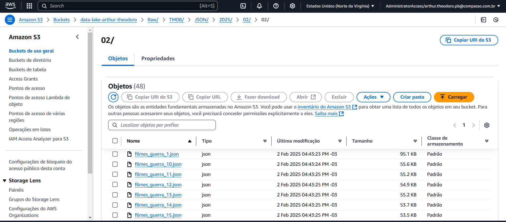
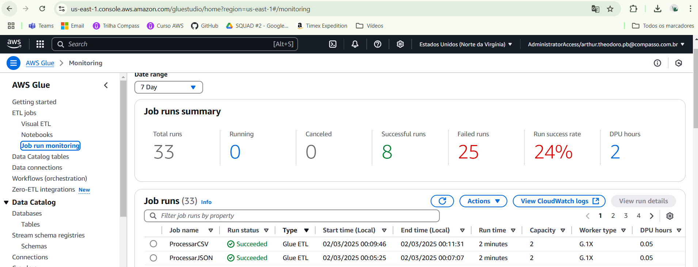
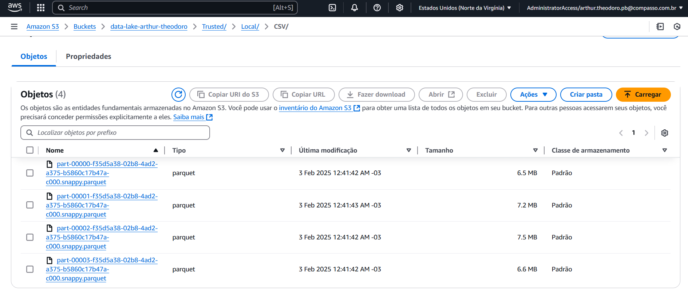
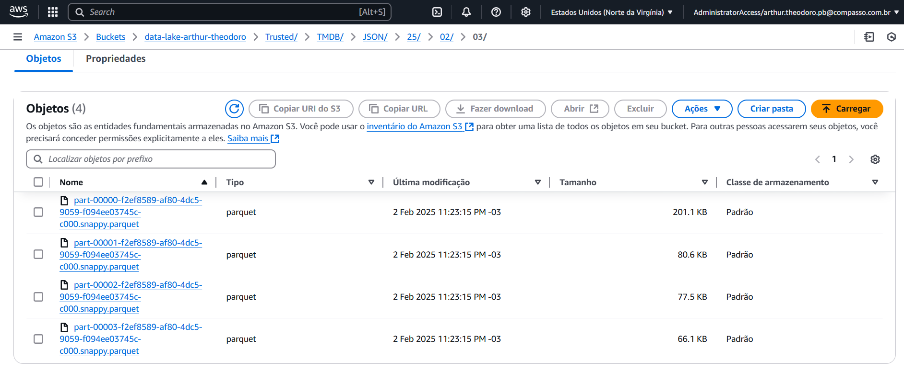

<h1 align="center">Resolução do Desafio ✍️</h1>

### 📝 Explicação sobre o desafio

O objetivo deste desafio foi utilizar o Apache Spark por meio do serviço AWS Glue para integrar dados da camada RAW Zone do Data Lake do desafio final à Trusted Zone. Para isso, os dados foram tratados, transformados em formato Parquet e, em seguida, inseridos na Trusted Zone.

### Reingestão dos dados na camada RAW

O [desafio da sprint passada](/Sprint%207/Desafio/README.md) foi justamente ingerir dados na camada RAW do Data Lake, e isso foi feito com sucesso. No entanto, percebi que, para responder de maneira satisfatória às perguntas da minha análise, seria necessário obter mais dados da API do TMDB. Por isso, coletei todos os filmes dentro dos filtros previamente definidos, totalizando 4.800 títulos, uma amostra satisfatória.

- Novos dados da camada RAW no S3
- 

### Processamento CSV

- O código [ProcessamenoCSV.py](./ProcessamentoCSV.py) é o responsável por tratar, transformar em parquet e upar para o S3 o arquivo movies.sv persistido na RAW Zone, tudo isso através do AWS Glue

- O primeiro passo do código foi importar todas as bibliotecas que serão usadas nele.
    - ```````
        import sys
        from pyspark.sql import SparkSession
        from awsglue.context import GlueContext
        from awsglue.job import Job
        from awsglue.utils import getResolvedOptions
        from awsglue.dynamicframe import DynamicFrame
        from pyspark.sql.functions import col, current_date
        `````````

- Após a importação das bibliotecas, foi possível iniciar o desenvolvimento do código. Como a execução ocorre no AWS Glue, foi necessário definir os parâmetros do JOB para garantir a correta interpretação e funcionamento dentro do serviço.

    - ```````
        args = getResolvedOptions(sys.argv, ['JOB_NAME'])
        ````````

- Com os argumentos definidos, foi necessário iniciar a sessão Spark para possibilitar o uso do Spark no código. Além disso, também foi iniciada a GlueContext, que estende a funcionalidade do Spark, permitindo a integração com os serviços do AWS Glue e facilitando o processamento e a transformação dos dados.

    - ````````
        spark = SparkSession.builder.appName(args['JOB_NAME']). getOrCreate()
        glueContext = GlueContext(spark.sparkContext)
        job = Job(glueContext)
        job.init(args['JOB_NAME'], args)

        ``````````
- Com as configurações iniciais feitas, então defini os caminhos. Tanto o caminho no qual o arquivo que será tratado no código está, quanto o caminho que o arquivo, ao final de todo o processamento, será persistido no S3.
    - ````````
        raw_path = 's3://data-lake-arthur-theodoro/Raw/Local/CSV/Movies/2025/01/06/movies.csv'
        trusted_path = 's3://data-lake-arthur-theodoro/Trusted/Local/CSV/movie.parquet'
        ``````````
- Uma vez que os caminhos foram definidos, se tornou possível criar um DataFrame, então fiz isso utilizando o Spark
    - ````````
        df = spark.read.option("header", "true").csv(raw_path)
        ````````

- A criação do DataFrame marcou o início do tratamento dos dados. No caso do arquivo CSV, optei por lidar apenas com os valores nulos, uma vez que todas as colunas serão utilizadas futuramente. Assim, decidi deixar o tratamento mais detalhado para a etapa de normalização do banco de dados.

    - `````````
        df = df.fillna(0)
        ``````````

- Agora, com todas as etapas anteriores concluídas, foi possível transformar o DataFrame originado do CSV para o formato Parquet e enviá-lo para o S3 na Trusted Zone. O método mais simples que encontrei foi converter o DataFrame em um DynamicFrame, o que facilita o AWS Glue a processar os dados, e utilizar o método ``write_dynamic_frame.from_options()`` para converter o arquivo para Parquet e enviá-lo ao S3.
    - ````````
        # Convertendo para DynamicFrame
        dynamic_frame = DynamicFrame.fromDF(df, glueContext, "dynamic_frame")
    
        #Mudando para Parquet e upando para o S3
        glueContext.write_dynamic_frame.from_options(
            frame=dynamic_frame,
            connection_type="s3",
            connection_options={"path": trusted_path},
            format="parquet"
            )
        ````````

### Processamento JSON

- O arquivo [ProcessamentoJSON.py](../Desafio/ProcessamentoJSON.py) segue a mesma estrutura do [ProcessamenoCSV.py](./ProcessamentoCSV.py), as maiores diferenças estão no caminho de saída dos JSON e no tratamento de dados dos mesmos.

#### Caminho de saída
- O caminho de saída do JSON precisava, obrigatoriamente, conter a data do dia em que os arquivos foram enviados para o S3, a fim de seguir corretamente a estrutura de pastas esperada na Trusted Zone.
- Para garantir essa estrutura, utilizei os métodos select() e collect() do PySpark para obter a data desejada. Em seguida, concatenei essa informação ao caminho de saída base, de forma semelhante ao que foi feito para o arquivo CSV.
    - ```````
        data_processamento = df.select(date_format(current_date(), "yy/MM/dd")).collect()[0][0]

        # Defininido o caminho de saída
        path_saida = f"{path_de_base}{data_processamento}/"
        ``````````

#### Tratamento dos Dados
- Diferentemente do CSV, nem todas as colunas do arquivo JSON serão utilizadas. Por isso, aproveitei essa etapa de tratamento para filtrar apenas as colunas relevantes para a análise do desafio final, mantendo, no entanto, o tratamento mais detalhado para a etapa de normalização das tabelas.
    - `````````
        #Selecionando colunas relevantes
        df = df.select("genre_ids", "id", "original_language", "original_title", "overview", "popularity", "release_date", "title", "vote_average", "vote_count")

        #Tratamento de valores nulos
        df = df.fillna(0)       
        ````````

### Execução dos Jobs
- Com ambos os Jobs Criados, então parti para a execução deles.
    - Comprovação da execução bem sucedida de ambos os Jobs:
    
    - Comprovação da Trusted Zone do CSV
    
    - Comprovação da Trusted Zone do JSON
    