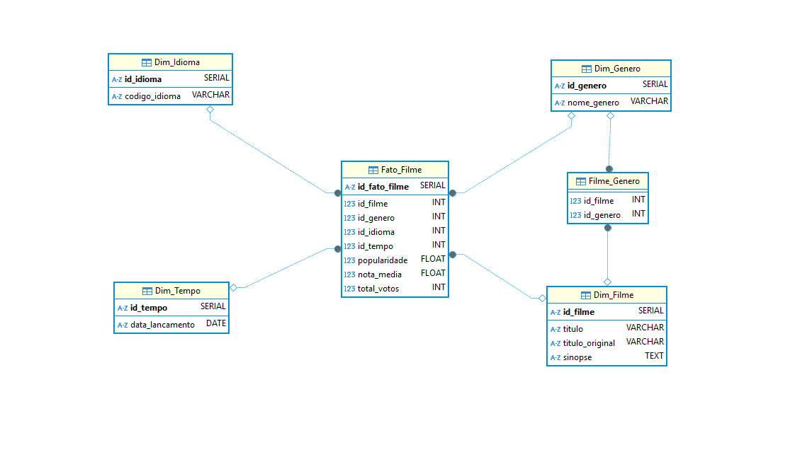
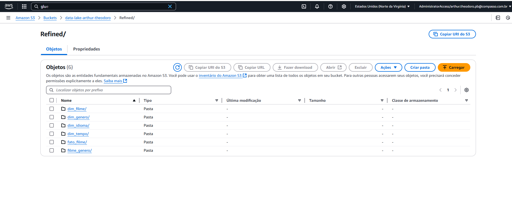
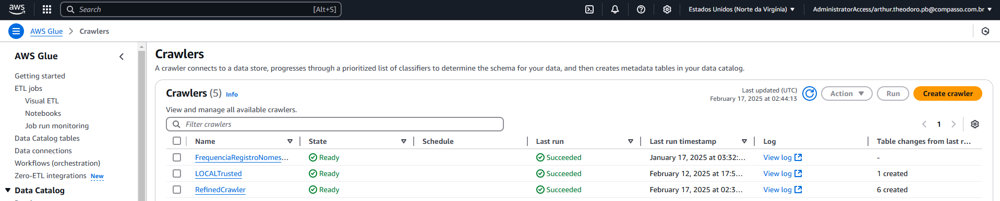
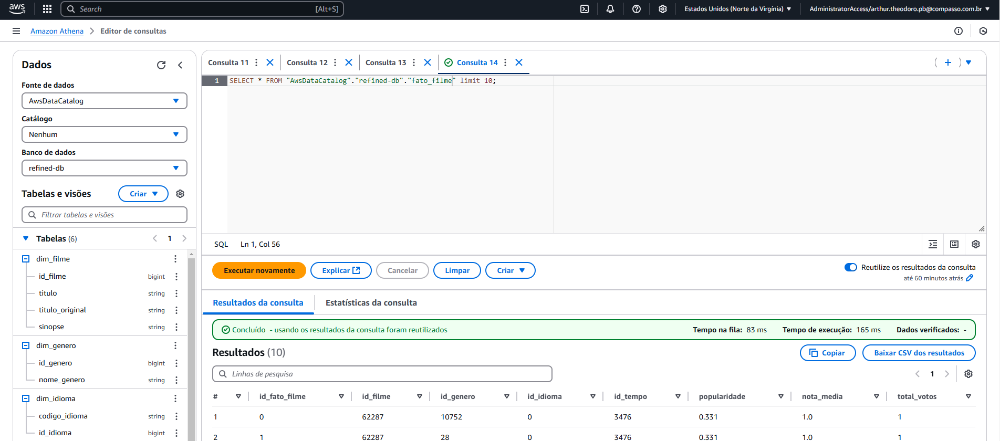
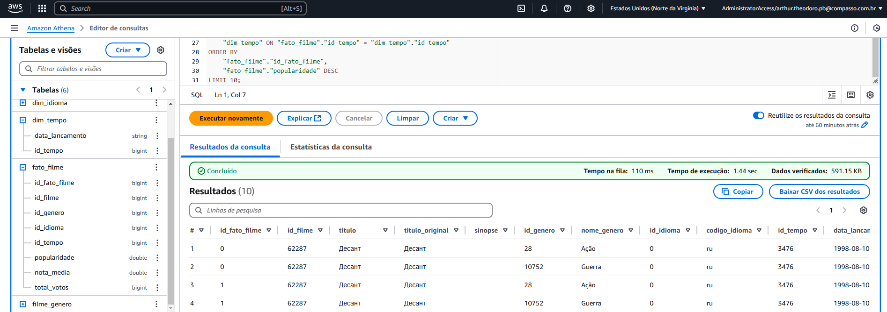
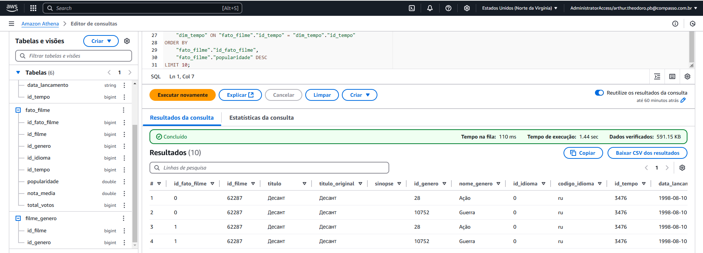

<h1 align="center">Resolução do Desafio ✍️</h1>

### 📝 Explicação sobre o desafio

O objetivo deste desafio é desenvolver a camada Refined do data lake do desafio final, aplicando uma modelagem dimensional aos dados que anteriormente estavam armazenados na camada Trusted. Tudo isso, utilizado o Apache Spark SQL por meio do serviço AWS Glue, e o Glue Crawler para criar as tabelas dimensionais e a tabela fato, permitindo que os dados sejam consultados posteriormente no Amazon QuickSight.  

### Minhas Perguntas para o desafio final

- Nessa etapa, precisei ajustar duas das perguntas que havia planejado inicialmente. Ao analisar melhor a base de dados, percebi que não haveria informações suficientes no CSV sobre os atores dos filmes de guerra. Por isso, adaptei as perguntas para focar apenas nos filmes, deixando de lado os detalhes sobre atores e diretores.

#### Novas Perguntas:

1. Como a frequência de lançamentos de filmes de crime/guerra variou ao longo das décadas da Guerra Fria (1947-1991)?
 
2. Quais são os temas ou enredos mais comuns nos filmes de crime/guerra durante os momentos de maior tensão da Guerra Fria, como a Crise dos Mísseis de Cuba (1962) ou a Guerra do Vietnã (1955-1975)?
 
3. Como o país de produção dos filmes influenciou a representação de nacionalidades e conflitos nas narrativas cinematográficas?
 
4. Existe uma tendência nas produções de filmes de crime/guerra ao longo da Guerra Fria que reflete mudanças nas percepções públicas de ameaças internacionais?
 
5. Como a popularidade média e a avaliação do público dos filmes de crime/guerra variaram ao longo do período da Guerra Fria, e há correlação com eventos históricos específicos?"

### 1º Passo: Análise Dimensional

- Diagrama Dimensional:
- 

#### Tabela Fato
- A tabela fato armazena as principais métricas relacionadas ao desempenho dos filmes, como as colunas ``popularidade``, ``nota_media`` e ``total_votos``. Além disso, ela contém todas as chaves estrangeiras das demais tabelas, que são: ``id_filme``, ``id_genero``, ``id_idioma`` e ``id_tempo``.

#### Dimensões
- Optei por criar quatro dimensões e uma tabela de ligação para resolver a relação de muitos para muitos (N:N) entre as tabelas ``dim_genero`` e ``dim_filme``. Essa abordagem foi necessária pois um filme pode pertencer a vários gêneros, e um gênero pode estar associado a vários filmes. A tabela de ligação serve justamente para que não haja problemas nessa relação, garantindo a normalização das dimensões.

- Dimensão Idioma: Possui todos os idiomas presente nos filmes, além de armazenar o id de cada idioma

- Dimensão Tempo: Possui todas as datas de lançamentos dos filmes, além de armazenar o id de cada data

- Dimensão Filme: Possui todos os dados que não fazem respeito ao desempenho dos filmes, como ``titulo``, ``titulo_original`` e ``sinopse``.

- Dim_Genero: Possui todos os gêneros dos filmes, nominalmente, além de armazenar o id de cada gênero

- Filme_Genero: Tabela de ligação, responsável por manter a normalização das tabelas ``dim_filme`` e ``dim_genero``

### 2º Passo: Script

- Com as dimensões já definidas, a criação do script se tornou muito mais fácil. Bastou transformar o [código responsável por criar as dimensões](../Desafio/Dimensional.sql) em Spark SQL, o adaptando para ser utilizado no AWS Glue e para ler e gravar dados no S3.

#### O Script
- O [script](../Desafio/Dimensional.py) criado processa os dados da Trusted, os transforma em tabelas dimensionais, de ligação e uma tabela fato, e então salva o resultado na camada refined.

#### Importação das bibliotecas e inicialização do Spark e GlueContext

- O primeiro passo do Script foi importar as bibliotecas e as funções do PySpark que serão utilizadas no código futuramente.
    - `````````
        import sys
        from pyspark.context import SparkContext
        from pyspark.sql.functions import col, explode, monotonically_increasing_id, when
        from awsglue.transforms import *
        from awsglue.utils import getResolvedOptions
        from awsglue.context import GlueContext
        ``````````

###

- Após a importação das bibliotecas, foi possível iniciar o Spark e o GlueContext 
    - ````````
        args = getResolvedOptions(sys.argv, ["JOB_NAME"])
        sparkContext = SparkContext()
        glueContext = GlueContext(sparkContext)
        spark = glueContext.spark_session
        ````````

#### Criação do dataframe

- Com o Spark e o GlueContext devidamente iniciados, foi possível ler os dados persistidos na camada Trusted do S3, através do ``dynamic_frame`` do GlueContext e posteriormente transforma-los em um dataframe do Spark
    - ```````
        caminho_trusted = "s3://data-lake-arthur-theodoro/Trusted/TMDB/JSON/25/02/03/"
        df_trusted = glueContext.create_dynamic_frame.from_options(
            format="parquet",
            connection_type="s3",
            connection_options={"paths": [caminho_trusted]},
            transformation_ctx="df_trusted"
        ).toDF()
        ````````

#### Criação das Dimensões/Tabela de Ligação/Tabela Fato

- Agora que todas as etapas iniciais foram feitas, então comecei a efetivamente criar as dimensões.

#### dim_filme
 
- A primeira dimensão criada foi a ``dim_filme``. Como todas as colunas necessárias já estavam presentes nos dados persistidos na camada trusted, bastou selecionar as colunas usando um ``select()`` e renomear as colunas com o método ``alias()``.
    - `````
        dim_filme = df_trusted.select(
        col("id").alias("id_filme"),
        col("title").alias("titulo"),
        col("original_title").alias("titulo_original"),
        col("overview").alias("sinopse")
        ).distinct()
        ``````
- Para gravar a tabela na camada refined, utilizei o método ``write.mode(overwirte)``, para sobrescrever qualquer arquivo existente no caminho especificado do S3. O caminho definido foi o da camada refined, dentro da pasta ``dim_filme``, e o formato do arquivo foi definido como parquet.
    - ```````
        dim_filme.write.mode("overwrite").parquet("s3://data-lake-arthur-theodoro/Refined/dim_filme/")

         ````````

#### dim_genero
- Na codificação da ``dim_genero``, precisei utilizar o método ``explode()``, na criação da coluna ``id_genero``, para garantir que cada gênero fosse separado em uma linha única. Isso foi necessário porque os gêneros estavam originalmente agrupados em uma única coluna. Combinando o ``explode()`` com o método ``distinct()``, consegui garantir que cada gênero fosse armazenado apenas uma vez, atribuindo um ``id_genero`` único para cada um deles. 
    - ````````
        dim_genero = df_trusted.select(explode(col("genre_ids")).alias("id_genero")).distinct()
        ````````
- Para a coluna ``nome_genero``, utilizei a função ``when()`` para associar corretamente cada nome de gênero ao seu respectivo ``id_genero``.
    - ```````
        dim_genero = dim_genero.withColumn(
        "nome_genero",
        when(col("id_genero") == 10752, "Guerra")
        .when(col("id_genero") == 28, "Ação")
        .when(col("id_genero") == 12, "Aventura")
        .when(col("id_genero") == 878, "Ficção Científica")
        .when(col("id_genero") == 10749, "Romance")
        .when(col("id_genero") == 36, "História")
        .when(col("id_genero") == 99, "Documentário")
        .when(col("id_genero") == 10402, "Musical")
        .when(col("id_genero") == 80, "Crime")
        .when(col("id_genero") == 18, "Drama")
        .when(col("id_genero") == 10770, "Filme de TV")
        .when(col("id_genero") == 27, "Terror")
        .when(col("id_genero") == 35, "Comédia")
        .when(col("id_genero") == 16, "Animação")
        .when(col("id_genero") == 10751, "Familia")
        .when(col("id_genero") == 14, "Fantasia")
        .when(col("id_genero") == 53, "Suspense")
        .when(col("id_genero") == 37, "Velho Oeste")
        .when(col("id_genero") == 9648, "Mistério")
        .otherwise("Desconhecido")
        ````````

- Para gravar a tabela no S3, segui a mesma lógica da ``dim_filme``
    - ````````
        dim_genero.write.mode("overwrite").parquet("s3://data-lake-arthur-theodoro/Refined/dim_genero/")
        ````````

#### dim_idioma e dim_tempo

- Para as dimensões ``dim_idioma`` e ``dim_tempo``, segui a mesma lógica na criação. Primeiro, selecionei as colunas já existentes nos dados persistidos na camada trusted. Em seguida, utilizei o método ``monotonically_increasing_id()`` para gerar os IDs únicos de ambas as tabelas. Para salvar as dimensões no S3, utilizei a mesma lógica da ``dim_filme``
    - ``````
        #dim_idioma
        dim_idioma = df_trusted.select(col("original_language").alias("codigo_idioma")).distinct().withColumn("id_idioma", monotonically_increasing_id())

        dim_idioma.write.mode("overwrite").parquet("s3://data-lake-arthur-theodoro/Refined/dim_idioma/")


        #dim_Tempo
        dim_tempo = df_trusted.select(col("release_date").alias("data_lancamento")).distinct().withColumn("id_tempo", monotonically_increasing_id())
    
        dim_tempo.write.mode("overwrite").parquet("s3://data-lake-arthur-theodoro/Refined/dim_tempo/")
        ````````

#### filme_genero
- Na tabela de ligação ``filme_genero`` utilizei o select para selecionar a coluna ``id_filme`` que já existia nos dados persistidos no S3 e utilizei o método ``explode()``, seguindo a mesma lógica de quando ele foi utilizado na ``dim_genero``. Para salvar a dimensão no S3, utilizei a mesma lógica da ``dim_filme``
    - ````````
        #filme_genero (Tabela de ligação)
        filme_genero = df_trusted.select(col("id").alias("id_filme"),explode(col("genre_ids")).alias("id_genero"))

        filme_genero.write.mode("overwrite").parquet("s3://data-lake-arthur-theodoro/Refined/filme_genero/")
        ``````````

#### fato_filme
- Após a criação de todas as dimensões, foi possível criar a tabela .
- Na criação da tabela fato, foi necessário fazer 2 Joins, o primeiro foi dos dados persistidos na trusted com a dim_idioma e o segundo com a dim_tempo, ambos vizando conseguir pegar o id das dimensões. 
- Após os Joins, então bastou selecionar as colunas que a tabela fato iria armazenar, e assim foi feito.
- Para salvar a dimensão no S3, utilizei a mesma lógica da ``dim_filme``
    - ````````
        fato_filme = df_trusted.join(dim_idioma, df_trusted.original_language == dim_idioma.codigo_idioma).join(dim_tempo, df_trusted.release_date == dim_tempo.data_lancamento) \
        .select(
        monotonically_increasing_id().alias("id_fato_filme"),
        col("id").alias("id_filme"),
        explode(col("genre_ids")).alias("id_genero"),
        col("id_idioma"),
        col("id_tempo"),
        col("popularity").alias("popularidade"),
        col("vote_average").alias("nota_media"),
        col("vote_count").alias("total_votos")
        )
                       
        fato_filme.write.mode("overwrite").parquet("s3://data-lake-arthur-theodoro/Refined/fato_filme/")
        ````````

### 3º Passo: Execução do Job Glue

- Após a criação do script e a sua execução, os dados foram persistidos corretamente no S3.

- Evidência dos dados no S3


### 4º Passo: Execução do Crawler e criação das tabelas

- Com os dados corretamente armazenados no S3, foi possível configurar um crawler no AWS Glue. Esse crawler varreu todos os arquivos da camada Refined e criou automaticamente as tabelas no Glue Data Catalog. Com as tabelas disponíveis no GlueContext, elas agora estão prontas para serem utilizadas no Amazon QuickSight.

- Evidência da criação da Refined Crawler e sua correta execução
- 

- Evidências das criação correta das tabelas no Glue Data Catalog
- 
- 
- 